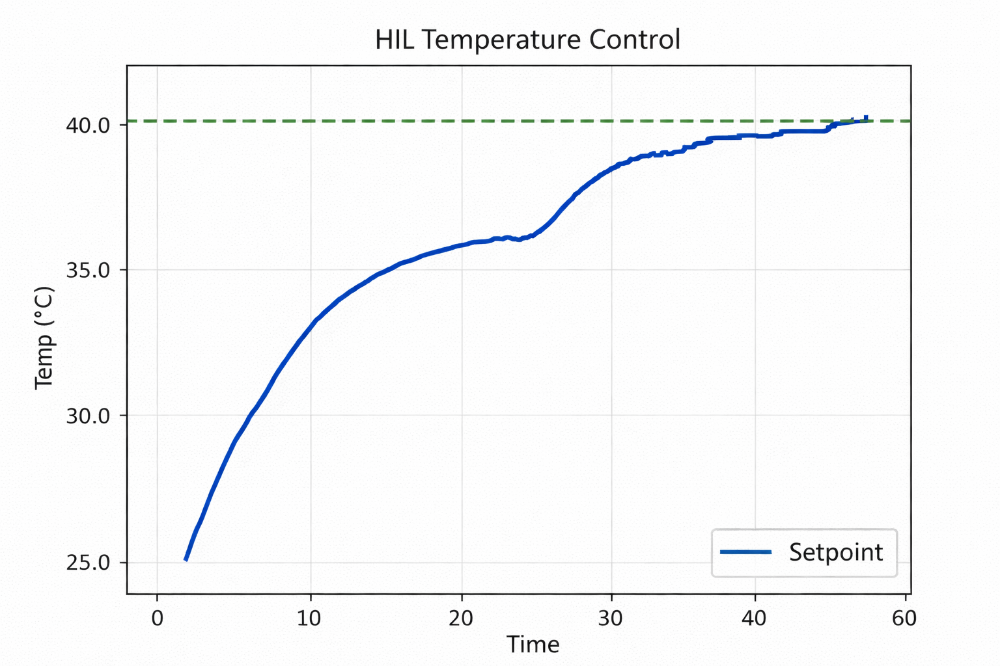

# Hardware-in-the-Loop (HIL) Temperature Control Using a Resistive Heater

**Swastik Kumar Rout**  
Department of Electrical Engineering  
Indian Institute of Technology, Kharagpur  

---

## Abstract

This project demonstrates a complete **hardware-in-the-loop (HIL)** temperature control system using low-cost resistive heaters, an NTC thermistor, and a PID controller. The objective was to regulate the temperature of a physical heating element to a desired setpoint using feedback from a real sensor, while the control logic and visualization were executed on a host system. The system successfully achieved stable closed-loop control within the physical constraints of the hardware. Experimental results showed a maximum achievable steady-state temperature of approximately **40–41 °C** at an ambient temperature of **19–20 °C**, which informed the final choice of setpoint.

---

## 1. Introduction

Temperature control is a classical control problem with wide applications in electronics, industrial processes, and embedded systems. While simulations are useful for controller design, real systems are subject to physical constraints such as actuator limits, heat losses, and sensor placement effects.

This project was undertaken to:

* Implement a real-time PID temperature controller
* Integrate a physical heating element and temperature sensor into a HIL setup
* Study the effects of actuator saturation and thermal limitations on closed-loop performance

The emphasis was not only on achieving setpoint tracking, but also on understanding the interaction between control algorithms and physical system constraints.

---

## 2. System Overview

### 2.1 Hardware Components

* **Heating element:** Multiple low-cost resistors used as resistive heaters
* **Temperature sensor:** 10 kΩ NTC thermistor encapsulated in a metal probe
* **Controller interface:** Microcontroller (ADC + PWM) communicating with host PC
* **Actuator:** PWM-driven power stage controlling heater current

### 2.2 Sensor Placement and Thermal Coupling

The thermistor probe was placed in direct physical contact with the bodies of the heating resistors. Experimental testing showed that coupling the probe to **all active resistors** (or a common thermal region) provided a representative measurement of system temperature. Partial contact resulted in underestimation of the true heating effect and unstable readings.

---

## 3. Control Architecture

### 3.1 Hardware-in-the-Loop (HIL) Setup

In the HIL configuration:

* The **plant** (heater + thermal dynamics) was entirely physical
* The **sensor** (thermistor + ADC) provided real temperature feedback
* The **controller** (PID logic, plotting, and supervision) ran on the host system

Sensor data was streamed to the controller, which computed the control action and sent a PWM command back to the microcontroller.

### 3.2 PID Controller

A discrete-time PID controller was implemented with the following nominal gains:

* $K_p = 20.0$
* $K_i = 60.0$
* $K_d = 0.0$

The control signal was limited to the allowable PWM range (0–255). Anti-windup behavior was enforced by output saturation and bounded integral action.

---

## 4. Experimental Conditions

* **Ambient (room) temperature:** 19–20 °C
* **Power supply:** Limited to safe operating range of the resistive heaters
* **Maximum PWM:** 255 (full duty cycle)

All experiments were conducted under consistent ambient conditions to ensure repeatability.

---

## 5. Results and Observations

### 5.1 Open-Loop Heating Behavior

When driven at full PWM, the heating system exhibited a first-order thermal response, with an initially rapid temperature rise followed by a gradual approach to a steady-state value.

The maximum achievable steady-state temperature was observed to be:

> **40–41 °C at an ambient temperature of 19–20 °C**

This limit was consistent across multiple trials and independent of controller tuning.

### 5.2 Closed-Loop Performance

With the PID controller enabled and the setpoint initially set above the physical limit (e.g., 45 °C), the controller saturated the actuator but could not eliminate the steady-state error. This behavior correctly indicated an actuator/plant limitation rather than a tuning issue.

After adjusting the setpoint to **40 °C**, the controller achieved:

* Stable convergence to the setpoint
* Smooth temperature trajectory
* No sustained oscillations
* No integrator windup

The closed-loop response closely matched the expected behavior of a well-tuned controller operating within physical constraints.

---

## 6. Discussion

### 6.1 Physical Limits vs. Controller Tuning

A key outcome of this project was the clear distinction between controller performance and plant capability. Increasing PID gains beyond a certain point did not increase the achievable temperature, as the system was limited by heater power and thermal losses to the environment.

This reinforces an important control principle:

> **PID controllers shape system dynamics but cannot overcome fundamental energy or actuator limitations.**

### 6.2 Effect of Ambient Temperature

The relatively low ambient temperature (19–20 °C) increased convective and conductive heat losses, thereby reducing the maximum achievable steady-state temperature. Under warmer ambient conditions, a slightly higher steady-state temperature was briefly observed, further confirming the thermal nature of the limitation.

---

## 7. Conclusion

This project successfully demonstrated a hardware-in-the-loop temperature control system using inexpensive components. The PID controller performed as expected, providing stable and smooth regulation when the setpoint was chosen within the physical limits of the system.

Key takeaways include:

* Correct sensor placement and thermal coupling are critical for meaningful feedback
* Actuator saturation and steady-state limits must be identified experimentally
* Controller tuning cannot compensate for insufficient actuator authority

By selecting a final setpoint of **40 °C**, the system achieved reliable and repeatable performance, meeting the project objectives while respecting real-world constraints.

---

## 8. Future Improvements

Potential enhancements to the system include:

* Improved thermal insulation to reduce heat loss
* Higher-power or more efficient heating elements
* Use of a shared thermal mass (e.g., metal block or heatsink)
* Adaptive or gain-scheduled control to account for changing ambient conditions

These improvements could extend the achievable temperature range while preserving stable control behavior.

---

## 9. Acknowledgment

This project emphasizes practical control engineering principles learned through experimentation and iterative debugging, highlighting the importance of aligning control objectives with physical system capabilities

---

## Final plot

