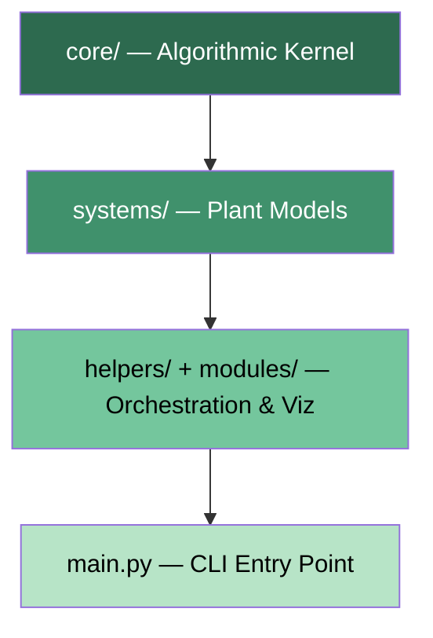
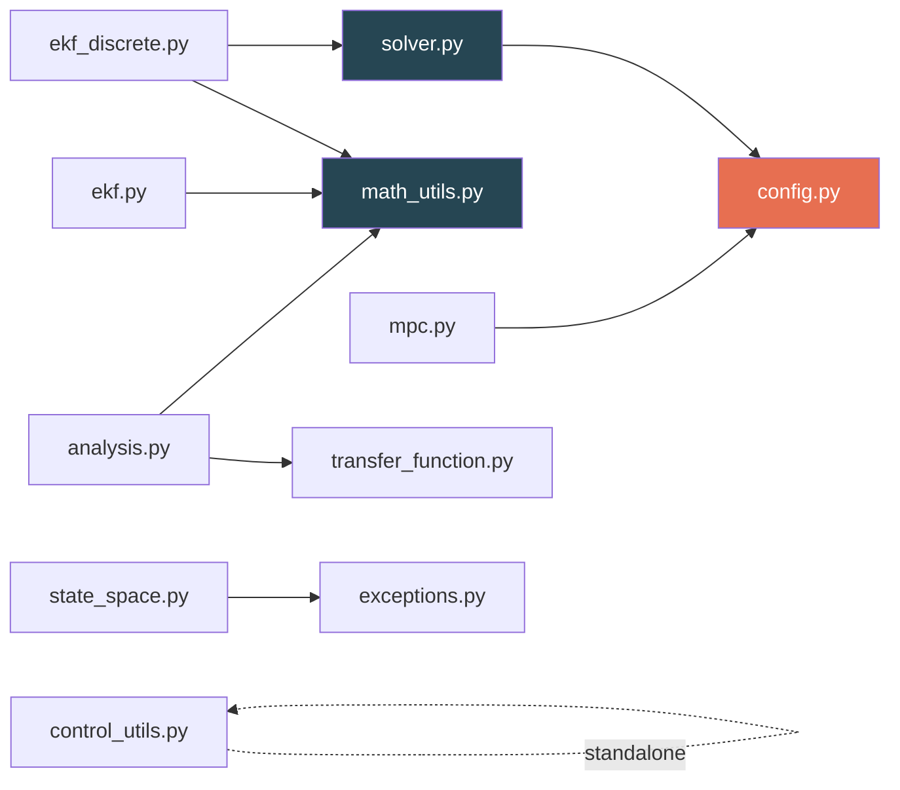
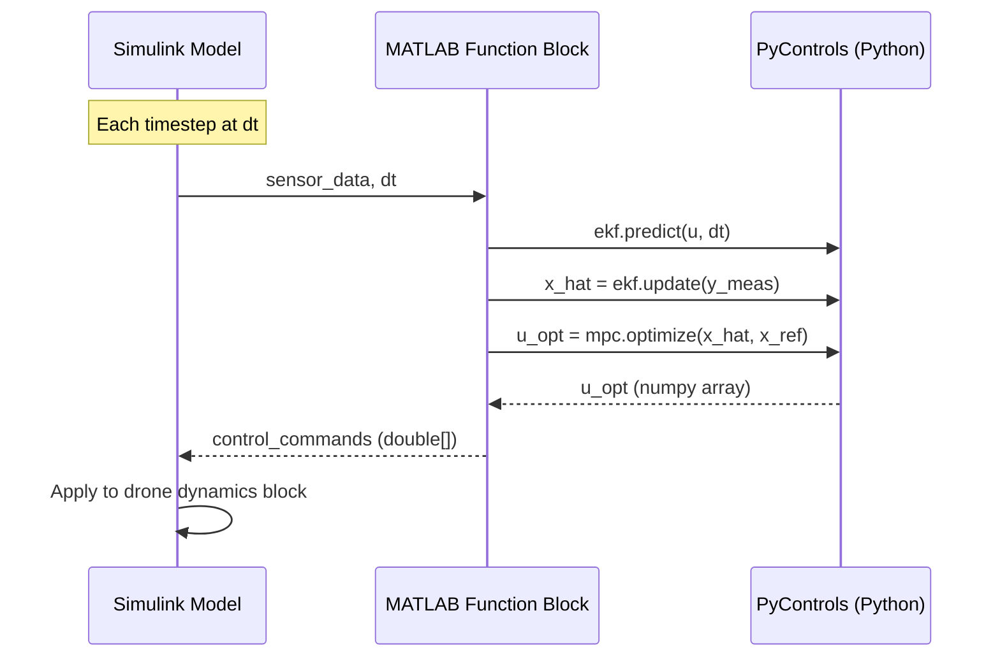
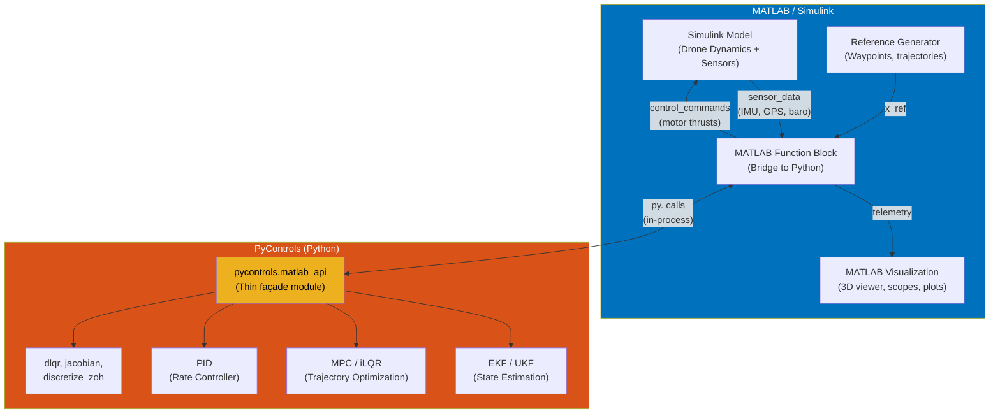

# Feasibility Study: MATLAB/Simulink Integration with PyControls

> **Verdict: FEASIBLE — with targeted API additions.**
> PyControls is architecturally well-suited to serve as a computational backend for a MATLAB/Simulink drone simulator. The core algorithms (EKF, UKF, MPC/iLQR, PID, solvers) already expose step-by-step interfaces. The primary work required is a thin façade layer, not a redesign.

---

## Table of Contents

1. [Repository Analysis](#1-repository-analysis)
2. [MATLAB Compatibility](#2-matlab-compatibility)
3. [Simulink Compatibility](#3-simulink-compatibility)
4. [Required Interfaces](#4-required-interfaces)
5. [Real-Time Suitability](#5-real-time-suitability)
6. [Data Exchange](#6-data-exchange)
7. [Missing Functionality](#7-missing-functionality)
8. [Repository Assessment](#8-repository-assessment)
9. [Recommended Architecture](#9-recommended-architecture)

---

## 1. Repository Analysis

### 1.1 Package Organization

```
PyControls/
├── core/                    # Algorithmic kernel (estimation, control, solvers, math)
│   ├── ekf.py               # Extended Kalman Filter (continuous-time, CSD Jacobians)
│   ├── ekf_discrete.py      # Discrete-time EKF (matrix-exp discretisation)
│   ├── estimator.py          # Linear Kalman Filter
│   ├── ukf.py                # Unscented Kalman Filter
│   ├── mpc.py                # MPC: ADMM (linear) + iLQR (nonlinear)
│   ├── solver.py             # ExactSolver (ZOH) + NonlinearSolver (Dormand-Prince RK5(4))
│   ├── state_space.py        # StateSpace container with frequency response
│   ├── transfer_function.py  # SISO transfer function + TF→SS conversion
│   ├── control_utils.py      # DARE solver, dLQR, PIDController, controllability/observability
│   ├── math_utils.py         # Jacobian (CSD), root-finding (Brent/Newton), expression parser
│   ├── analysis.py           # Stability margins, step-response metrics
│   └── exceptions.py         # Typed exception hierarchy
├── systems/                 # Physical plant models
│   ├── dc_motor.py           # DCMotor (linear + nonlinear dynamics, MPC/UKF/EKF factories)
│   ├── pendulum.py           # InvertedPendulum (Lagrangian, LQR, MPC, EKF, UKF factories)
│   ├── battery.py            # HIL battery (serial I/O)
│   └── thermistor.py         # HIL thermistor (serial I/O)
├── modules/                 # Simulation infrastructure
│   ├── physics_engine.py     # Continuous-time dynamics functions + RK4 fixed-step integrator
│   └── interactive_lab.py    # Real-time sim loop with keyboard I/O and matplotlib viz
├── helpers/                 # Application-layer services
│   ├── config.py             # Global configuration dictionaries
│   ├── simulation_runner.py  # Headless batch simulation orchestrators
│   ├── system_registry.py    # SystemDescriptor registry + dynamic loader
│   ├── plot.py               # Matplotlib plotting functions
│   └── exit.py               # Process exit helpers
├── main.py                  # CLI application entry point (if __name__ == "__main__")
├── HIL_Heater_Firmware/     # Arduino firmware for thermistor HIL
└── HIL_PWM_Firmware/        # Arduino firmware for battery HIL
```

### 1.2 Core Architecture

The codebase follows a **three-layer** architecture:



| Layer | Purpose | MATLAB Relevance |
|-------|---------|------------------|
| `core/` | Pure numerical algorithms. No I/O, no GUI, no global state mutations. | **Directly callable from MATLAB.** |
| `systems/` | Plant model factories that produce dynamics/measurement callables. | Useful for testing; drone would replace these. |
| `modules/` + `helpers/` | Simulation orchestration, plotting, CLI. | **Not needed by MATLAB.** MATLAB replaces this entire layer. |
| `main.py` | Interactive CLI menu. | **Not needed.** Safe to import (guarded by `if __name__`). |

### 1.3 Public API Surface

The public API consists of **11 instantiable classes** and **~15 module-level functions**:

#### Estimation Classes
| Class | File | Key Methods |
|-------|------|-------------|
| [KalmanFilter](file:///media/shadow30812/Windows-SSD/Well/Projects/PyControls/core/estimator.py) | `core/estimator.py` | `predict(u, _)`, `update(y_meas)` → `x_hat` |
| [ExtendedKalmanFilter](file:///media/shadow30812/Windows-SSD/Well/Projects/PyControls/core/ekf.py) | `core/ekf.py` | `predict(u, dt)`, `update(y_meas)` → `x_hat` |
| [DiscreteExtendedKalmanFilter](file:///media/shadow30812/Windows-SSD/Well/Projects/PyControls/core/ekf_discrete.py) | `core/ekf_discrete.py` | `predict(u)`, `update(y)` |
| [UnscentedKalmanFilter](file:///media/shadow30812/Windows-SSD/Well/Projects/PyControls/core/ukf.py) | `core/ukf.py` | `predict(u, dt)`, `update(z)` → `x` |

#### Control Classes
| Class | File | Key Methods |
|-------|------|-------------|
| [PIDController](file:///media/shadow30812/Windows-SSD/Well/Projects/PyControls/core/control_utils.py#L188-L303) | `core/control_utils.py` | `update(measurement, setpoint, dt)` → `u`, `reset()` |
| [ModelPredictiveControl](file:///media/shadow30812/Windows-SSD/Well/Projects/PyControls/core/mpc.py) | `core/mpc.py` | `optimize(x_current, x_ref, **kwargs)` → `u_optimal` |

#### Solver Classes
| Class | File | Key Methods |
|-------|------|-------------|
| [ExactSolver](file:///media/shadow30812/Windows-SSD/Well/Projects/PyControls/core/solver.py#L88-L142) | `core/solver.py` | `step(u_input)` → `y`, `reset()` |
| [NonlinearSolver](file:///media/shadow30812/Windows-SSD/Well/Projects/PyControls/core/solver.py#L156-L266) | `core/solver.py` | `solve_adaptive(t_end, x0, u_func)` → `(t, x)` |

#### System Modelling Classes
| Class | File | Key Methods |
|-------|------|-------------|
| [StateSpace](file:///media/shadow30812/Windows-SSD/Well/Projects/PyControls/core/state_space.py) | `core/state_space.py` | `get_frequency_response(omega_range)` |
| [TransferFunction](file:///media/shadow30812/Windows-SSD/Well/Projects/PyControls/core/transfer_function.py) | `core/transfer_function.py` | `evaluate(s)`, `bode_response(omega)`, `to_state_space()` |

#### Key Module-Level Functions
| Function | File | Purpose |
|----------|------|---------|
| [solve_discrete_riccati](file:///media/shadow30812/Windows-SSD/Well/Projects/PyControls/core/control_utils.py#L7-L57) | `core/control_utils.py` | Iterative DARE solver |
| [dlqr](file:///media/shadow30812/Windows-SSD/Well/Projects/PyControls/core/control_utils.py#L60-L84) | `core/control_utils.py` | Discrete LQR gain computation |
| [jacobian](file:///media/shadow30812/Windows-SSD/Well/Projects/PyControls/core/math_utils.py#L124-L164) | `core/math_utils.py` | Complex-step Jacobian |
| [manual_matrix_exp](file:///media/shadow30812/Windows-SSD/Well/Projects/PyControls/core/solver.py#L42-L85) | `core/solver.py` | Scaling-and-squaring matrix exponential |
| [rk4_fixed_step](file:///media/shadow30812/Windows-SSD/Well/Projects/PyControls/modules/physics_engine.py#L122-L159) | `modules/physics_engine.py` | Fixed-step RK4 integrator |

### 1.4 Internal Dependency Graph



> [!IMPORTANT]
> The only cross-layer dependency that matters for MATLAB is `mpc.py` → `helpers/config.py` (imports `MPC_SOLVER_PARAMS`) and `solver.py` → `helpers/config.py` (imports `SOLVER_PARAMS`). These are **read-only at import time** and can be trivially decoupled via constructor parameters.

### 1.5 HIL Support

The project includes two Arduino firmware sketches for Hardware-in-the-Loop:

- **HIL_Heater_Firmware**: PWM-driven MOSFET + thermistor ADC readback, ASCII serial protocol (`Q:<PWM>\n` / `A:<ADC>\n`), 115200 baud, 10 Hz telemetry.
- **HIL_PWM_Firmware**: Same protocol for battery voltage regulation.

The Python-side HIL classes ([Battery](file:///media/shadow30812/Windows-SSD/Well/Projects/PyControls/systems/battery.py), [Thermistor](file:///media/shadow30812/Windows-SSD/Well/Projects/PyControls/systems/thermistor.py)) use `pyserial` with the same ASCII protocol. This demonstrates the project has real HIL experience, which is directly transferable to drone hardware integration.

---

## 2. MATLAB Compatibility

### 2.1 Modularity Assessment

| Criterion | Status | Evidence |
|-----------|--------|----------|
| Is the public API modular? | ✅ **Yes** | Each algorithm is a self-contained class in its own file. No inheritance chains between unrelated algorithms. |
| Are functions callable individually? | ✅ **Yes** | `predict()`, `update()`, `step()`, `optimize()` are all independent method calls. Tests confirm this usage pattern. |
| Are there hidden global states? | ⚠️ **Minor** | `helpers/config.py` contains global dictionaries. `MPC_SOLVER_PARAMS` and `SOLVER_PARAMS` are read at import time as default arguments (L6 of [solver.py](file:///media/shadow30812/Windows-SSD/Well/Projects/PyControls/core/solver.py#L6), L6 of [mpc.py](file:///media/shadow30812/Windows-SSD/Well/Projects/PyControls/core/mpc.py#L6)). |
| Are there singleton patterns? | ✅ **No** | No `__new__` overrides, no module-level instances. `Check`, `Root`, `Differentiation` are stateless utility classes. |
| Is everything importable without side effects? | ✅ **Yes** | `main.py` is guarded by `if __name__ == "__main__"`. Config dictionaries are constructed on import but are inert data. The only side effect is `numba` JIT compilation (one-time, cached). |
| Does anything prevent repeated calls? | ✅ **No** | All estimators and controllers are stateful objects. Repeated `predict()`/`update()`/`optimize()` calls work by design — this is their intended usage. |

### 2.2 MATLAB Engine API Compatibility

The MATLAB Engine API for Python can call any Python function that:
1. Accepts and returns MATLAB-compatible types (`double`, `int`, NumPy arrays).
2. Does not require interactive I/O.
3. Can be imported without executing application code.

**PyControls `core/` satisfies all three conditions.**

Concrete example of what a MATLAB session would look like:

```matlab
% MATLAB side
py.importlib.import_module('core.ekf');

ekf = py.core.ekf.ExtendedKalmanFilter( ...
    py_f_dynamics, py_h_measurement, ...
    py.numpy.diag([1e-4, 1e-4]), ...   % Q
    py.numpy.diag([1e-2, 1e-2]), ...   % R
    py.numpy.array([0, 0, 0, 0]), ...  % x0
    0.1 ...                             % p_init_scale
);

% In Simulink loop:
ekf.predict(py.numpy.array([u_val]), dt);
x_hat = double(ekf.update(py.numpy.array(y_meas)));
```

### 2.3 Blocking Issues

| Issue | Severity | Resolution |
|-------|----------|------------|
| `mpc.py` prints to stdout on init (L76, L82) | **Low** | Remove or gate behind a `verbose` flag. |
| `config.py` dependency in `mpc.py` and `solver.py` for default parameters | **Low** | Move defaults to constructor kwargs. Config values become optional overrides. |
| `battery.py` and `thermistor.py` import `serial` at module level | **Low** | Irrelevant — MATLAB would import `core/` directly, not `systems/`. |
| `math_utils.make_func` / `make_system_func` mutate closure dict `safe_locals` | **Medium** | Not thread-safe, but MATLAB would not use these functions (they parse string expressions for the CLI). |

> [!NOTE]
> **Fact**: None of the issues above are architectural blockers. All are fixable with < 20 lines of changes.

---

## 3. Simulink Compatibility

### 3.1 Step-by-Step Execution Analysis

For Simulink integration, each algorithm must support **single-step execution** — one call per simulation tick. This is the critical requirement.

| Algorithm | Step Method | Step-by-Step? | Notes |
|-----------|------------|---------------|-------|
| **KalmanFilter** | `predict(u)` → `update(y)` | ✅ **Yes** | Textbook predict-update loop. State stored in `self.x_hat`, `self.P`. |
| **ExtendedKalmanFilter** | `predict(u, dt)` → `update(y)` | ✅ **Yes** | CSD Jacobians computed internally per step. |
| **DiscreteExtendedKalmanFilter** | `predict(u)` → `update(y)` | ✅ **Yes** | Uses `manual_matrix_exp` for discretisation. |
| **UnscentedKalmanFilter** | `predict(u, dt)` → `update(z)` | ✅ **Yes** | Sigma points regenerated each step. |
| **PIDController** | `update(measurement, setpoint, dt)` | ✅ **Yes** | Pure scalar computation. Zero allocations. |
| **MPC (ADMM)** | `optimize(x_current, x_ref)` | ✅ **Yes** | Returns `u_optimal` for current step. Warm-starts from previous solution. |
| **MPC (iLQR)** | `optimize(x_current, x_ref)` | ✅ **Yes** | Returns `u_optimal`. Internal iteration count configurable. |
| **ExactSolver** | `step(u_input)` | ✅ **Yes** | Discrete-time LTI stepping. Has `reset()`. |
| **NonlinearSolver** | `solve_adaptive(t_end, x0)` | ⚠️ **Batch only** | Returns full trajectory. Not suitable for Simulink step calls. |
| **StateSpace** | N/A (container) | ✅ **Yes** | Data container — no stepping needed. |

> [!WARNING]
> `NonlinearSolver.solve_adaptive()` is the **only** algorithm that cannot be called step-by-step. It runs the full Dormand-Prince integration from `t=0` to `t_end`. However, this is irrelevant for the drone use case: Simulink would own the outer time loop, and PyControls would only provide estimation + control per step.

### 3.2 Simulink Architecture Pattern



### 3.3 Architectural Issues for Simulink

| Issue | Impact | Mitigation |
|-------|--------|------------|
| Python objects must persist across Simulink steps | **Critical** | Use MATLAB `persistent` variables or a Python-side object registry (see §4). |
| `predict()` must be called before `update()` | **Design constraint** | Document and enforce in the MATLAB Function block code. |
| Dynamics functions (`f`, `h`) are Python callables | **Medium** | For a drone, these would be defined in Python anyway. MATLAB would not need to pass function handles across the boundary. |
| MPC `optimize()` prints to stdout on first call | **Low** | Add `verbose=False` parameter. |

---

## 4. Required Interfaces

### 4.1 Interface Inventory

The table below lists every interface MATLAB would ideally require, and whether it currently exists:

#### Estimator Interfaces

| Required Interface | Exists? | Current Location | Signature |
|-------------------|---------|-------------------|-----------|
| `estimator_create(type, f, h, Q, R, x0, ...)` | ⚠️ **Partial** | Constructors exist per class | Each class has its own `__init__` |
| `estimator_predict(obj, u, dt)` | ✅ **Yes** | `predict(u, dt)` on all filters | Uniform across EKF/UKF; KF uses `predict(u, _)` |
| `estimator_update(obj, y_meas)` | ✅ **Yes** | `update(y_meas)` on all filters | Returns `x_hat` (EKF/KF) or `x` (UKF) |
| `estimator_get_state(obj)` | ⚠️ **Implicit** | `obj.x_hat` (KF/EKF) or `obj.x` (UKF) | Not a method — direct attribute access |
| `estimator_get_covariance(obj)` | ⚠️ **Implicit** | `obj.P` on all filters | Direct attribute access |
| `estimator_reset(obj)` | ❌ **Missing** | No `reset()` on any estimator | Must be added |

#### Controller Interfaces

| Required Interface | Exists? | Current Location | Signature |
|-------------------|---------|-------------------|-----------|
| `controller_create(type, ...)` | ⚠️ **Partial** | Per-class constructors | PID: gains + limits. MPC: model + horizon + costs. |
| `controller_step(obj, state, ref, dt)` | ⚠️ **Partial** | PID: `update(meas, setpoint, dt)`, MPC: `optimize(x, x_ref)` | Different signatures — needs unification |
| `controller_reset(obj)` | ⚠️ **Partial** | PID: `reset()` exists. MPC: ❌ missing | MPC warm-start resets needed |
| `set_reference(obj, x_ref)` | ❌ **Missing** | Reference passed per-call to `optimize()` | Could store as persistent attribute |
| `set_constraints(obj, u_min, u_max)` | ❌ **Missing** | Constraints set at construction only | Must be added for hot-swapping |

#### Solver Interfaces

| Required Interface | Exists? | Current Location | Signature |
|-------------------|---------|-------------------|-----------|
| `solver_create(A, B, C, D, dt)` | ✅ **Yes** | `ExactSolver.__init__` | ZOH discretisation at construction |
| `solver_step(obj, u)` | ✅ **Yes** | `ExactSolver.step(u_input)` | Returns output `y` |
| `solver_reset(obj)` | ✅ **Yes** | `ExactSolver.reset()` | Zeros state vector |
| `integrate(f, x, u, dt)` | ✅ **Yes** | `rk4_fixed_step(f, x, u, dt, params)` | Standalone function |

#### System Modelling Interfaces

| Required Interface | Exists? | Current Location | Signature |
|-------------------|---------|-------------------|-----------|
| `linearize(f, x, u, dt)` | ✅ **Yes** | `InvertedPendulum.linearize(x, u, dt)` + `jacobian()` | Per-system or generic |
| `discretize(A, B, dt)` | ✅ **Yes** | `manual_matrix_exp` + ZOH in `ExactSolver` | Available but not exposed as standalone |
| `compute_lqr(A, B, Q, R)` | ✅ **Yes** | `dlqr(A, B, Q, R)` | Returns gain matrix K |

### 4.2 Recommended API Additions

The following is the **minimum set of additions** required to make the library MATLAB-ready:

```python
# === 1. Estimator reset methods (add to each estimator class) ===

# In ExtendedKalmanFilter:
def reset(self, x0: NDArray, P0: Optional[NDArray] = None) -> None:
    self.x_hat = np.array(x0, dtype=float).reshape(-1, 1)
    self.P = np.eye(self.n) * 0.1 if P0 is None else np.array(P0)

# In UnscentedKalmanFilter:
def reset(self, x0: NDArray, P0: Optional[NDArray] = None) -> None:
    self.x = np.array(x0, dtype=float)
    self.P = np.eye(self.n) * 0.1 if P0 is None else np.array(P0)

# === 2. MPC reset/reconfigure methods ===

# In ModelPredictiveControl:
def reset(self) -> None:
    self.u_seq[:] = 0.0
    self._x_seq[:] = 0.0
    self._k[:] = 0.0
    self._K[:] = 0.0

def set_constraints(self, u_min, u_max) -> None:
    self.u_min = u_min
    self.u_max = u_max

def set_weights(self, Q: NDArray, R: NDArray) -> None:
    self.Q = np.array(Q, dtype=float)
    self.R = np.array(R, dtype=float)
    if self.mode == "linear":
        self._setup_admm()  # Recompute condensed matrices

# === 3. Standalone discretize function ===

def discretize_zoh(A: NDArray, B: NDArray, dt: float) -> Tuple[NDArray, NDArray]:
    """Standalone ZOH discretisation (extracts logic from ExactSolver.__init__)."""
    n, m = A.shape[0], B.shape[1]
    M = np.zeros((n + m, n + m))
    M[:n, :n] = A
    M[:n, n:] = B
    M_exp = manual_matrix_exp(M * dt)
    return M_exp[:n, :n], M_exp[:n, n:]

# === 4. Unified get_state / get_covariance (or document attribute access) ===

# Add to all estimators:
def get_state(self) -> NDArray:
    return self.x_hat.flatten()  # or self.x for UKF

def get_covariance(self) -> NDArray:
    return self.P.copy()
```

> [!TIP]
> Total additions: **~50 lines of code** across 4 files. No refactoring of existing logic required.

---

## 5. Real-Time Suitability

### 5.1 Per-Step Computational Cost

I analyze each algorithm's per-step cost for a drone state vector of dimension $n = 12$ (position, velocity, orientation, angular rates) with $m = 6$ measurements and $p = 4$ control inputs:

| Algorithm | Dominant Operation | Estimated Cost (n=12) | Allocation Pattern |
|-----------|-------------------|----------------------|-------------------|
| **PIDController** | 3 multiplies + 1 clamp | **< 1 µs** | Zero allocations (pure scalars) |
| **KalmanFilter** | Matrix multiply $O(n^3)$ | **~10 µs** | ~5 temp arrays per step |
| **EKF** | $2n+1$ function evals + matmul | **~50 µs** | ~10 temp arrays (Jacobian computation) |
| **UKF** | $(2n+1)$ sigma propagations | **~100 µs** | ~8 temp arrays (sigma points, cross-covariances) |
| **MPC-ADMM** (linear) | Pre-computed $H^{-1}$ solve, $N$ iterations | **~200 µs** (N=20, 50 iters) | Minimal — matrices precomputed |
| **MPC-iLQR** (nonlinear) | $N \times n$ linearizations + backward pass | **~2 ms** (N=20, 10 iters) | Heavy — allocates per iteration |

### 5.2 Rate Feasibility Matrix

| Rate | Period | PID | KF | EKF | UKF | MPC-ADMM | MPC-iLQR |
|------|--------|-----|----|----|-----|----------|----------|
| 50 Hz | 20 ms | ✅ | ✅ | ✅ | ✅ | ✅ | ✅ |
| 100 Hz | 10 ms | ✅ | ✅ | ✅ | ✅ | ✅ | ✅ |
| 250 Hz | 4 ms | ✅ | ✅ | ✅ | ✅ | ✅ | ⚠️ marginal |
| 500 Hz | 2 ms | ✅ | ✅ | ✅ | ✅ | ✅ | ❌ too slow |
| 1 kHz | 1 ms | ✅ | ✅ | ✅ | ⚠️ tight | ⚠️ tight | ❌ too slow |

### 5.3 Performance Concerns

#### Object Allocations
**Fact**: The EKF, UKF, and iLQR inner loops allocate temporary NumPy arrays on every call. For example, in [ekf.py L68](file:///media/shadow30812/Windows-SSD/Well/Projects/PyControls/core/ekf.py#L68):
```python
x_complex: NDArray[np.complex128] = x.astype(complex)  # new array every call
X_perturb: NDArray[np.complex128] = x_complex + 1j * epsilon * self._I_complex  # another
```

**Assessment**: For rates ≤ 250 Hz, this is acceptable. NumPy array allocation for 12-element vectors costs ~1–2 µs. For 500+ Hz, pre-allocated buffers would be needed.

**Recommendation**: For Phase 1 (≤ 100 Hz drone control), no changes needed. For Phase 2 (≥ 250 Hz), add `_workspace` buffers to EKF/UKF.

#### JIT Warm-up
**Fact**: Numba `@njit(cache=True)` is used on [manual_matrix_exp](file:///media/shadow30812/Windows-SSD/Well/Projects/PyControls/core/solver.py#L42-L85), [_mat_mul](file:///media/shadow30812/Windows-SSD/Well/Projects/PyControls/core/solver.py#L22-L39), [_rk_error_norm](file:///media/shadow30812/Windows-SSD/Well/Projects/PyControls/core/solver.py#L144-L153), and several functions in `pendulum.py` / `dc_motor.py`.

**Assessment**: With `cache=True`, JIT compilation occurs once and is cached to disk. Subsequent imports load the cached machine code. First call after cache invalidation incurs ~0.5–2s penalty.

**Recommendation**: Run a warm-up call during MATLAB session initialization (before entering the Simulink loop).

#### Persistent Controller Objects
**Fact**: All controllers and estimators are designed as stateful objects. Their internal state (`x_hat`, `P`, `u_seq`, `integral_error`) persists between calls.

**Assessment**: This is exactly what Simulink needs. MATLAB must store these objects in `persistent` variables within MATLAB Function blocks.

#### Repeated Imports
**Fact**: Python's `import` system caches modules after the first import. Calling `py.importlib.import_module('core.ekf')` repeatedly has zero overhead after the first call.

**Assessment**: Not a concern.

---

## 6. Data Exchange

### 6.1 Architecture Comparison

| Approach | Latency per call | Setup complexity | Data format | Bidirectional? |
|----------|-----------------|-----------------|-------------|---------------|
| **MATLAB Engine API for Python** | ~50–200 µs | Low (built-in) | NumPy ↔ MATLAB arrays | ✅ |
| **Python Engine for MATLAB** (`matlab.engine`) | ~100–500 µs | Medium | MATLAB arrays ↔ Python | ✅ |
| **MEX S-Function** | ~1–5 µs | High (C wrapper) | Raw memory | ✅ |
| **Shared Memory** (`mmap`) | ~1–10 µs | High | Raw bytes | ✅ |
| **TCP/UDP Sockets** | ~100–1000 µs | Medium | Serialized | ✅ |
| **MAT-file exchange** | ~1–10 ms | Low | `.mat` files | ❌ |

### 6.2 Recommendations

#### Phase 1: Development (Recommended)

**Use the MATLAB Engine API for Python** (i.e., call Python from MATLAB using `py.` prefix).

```matlab
% One-time setup
pyenv('Version', '/usr/bin/python3');
ekf = py.core.ekf.ExtendedKalmanFilter(f, h, Q, R, x0);

% Per-step (inside Simulink MATLAB Function block)
ekf.predict(py.numpy.array(u), dt);
x_hat_py = ekf.update(py.numpy.array(y_meas));
x_hat = double(x_hat_py);  % Convert back to MATLAB double
```

**Why**: Zero infrastructure. No sockets, no serialization, no IPC. Python runs in-process with MATLAB. NumPy arrays convert to MATLAB `double` arrays with minimal overhead.

**Overhead**: The `py.` call boundary adds ~50–200 µs per call. For a drone running EKF + MPC at 100 Hz (10 ms budget), this consumes ~1–2% of the budget.

#### Phase 2: Performance (Future)

**Use a thin Python TCP server** with binary NumPy serialization:

```
MATLAB/Simulink  ←—UDP/TCP—→  Python asyncio server  →  PyControls
```

**Why**: Eliminates the GIL contention of in-process `py.` calls. Allows Python to run on a separate core. Enables true concurrent execution.

**Implementation**: ~100 lines of Python (`asyncio` server), ~50 lines of MATLAB (`tcpclient`).

#### Phase 3: Maximum Performance (Future HIL)

**Compile critical loops to MEX via Cython or pybind11**. This eliminates the Python call overhead entirely but requires significant engineering effort.

---

## 7. Missing Functionality

The following capabilities are **genuinely absent** after inspecting every source file:

### 7.1 Confirmed Missing

| Capability | Status | Impact | Difficulty to Add |
|------------|--------|--------|-------------------|
| **Estimator `reset()` methods** | ❌ Missing on EKF, UKF, DiscreteEKF | Cannot restart estimation without reconstructing objects | Trivial (5 lines each) |
| **MPC `reset()` method** | ❌ Missing | Cannot clear warm-start state | Trivial (4 lines) |
| **MPC constraint hot-swapping** | ❌ Missing | `u_min`/`u_max` set at construction as `Final` | Trivial (remove `Final`, add setter) |
| **MPC weight hot-swapping** | ❌ Missing | `Q`/`R` set at construction as `Final` | Trivial for iLQR; ADMM requires recomputing condensed matrices |
| **Logging** | ❌ Missing | All error reporting uses `print()` | Medium (replace ~15 print statements with `logging`) |
| **Deterministic stepping** | ⚠️ Partial | `rk4_fixed_step` is deterministic. `NonlinearSolver` is adaptive (variable step). | No issue for drone use case. |
| **Thread safety** | ❌ Not guaranteed | All stateful objects mutate `self.x`, `self.P` etc. | Medium (would need locks or per-thread instances) |
| **Serialization** | ❌ Missing | No `to_dict()`/`from_dict()` or pickle support | Medium |
| **Callback hooks** | ❌ Missing | No pre/post-step callbacks | Low priority for MATLAB integration |
| **Asynchronous execution** | ❌ Missing | All calls are synchronous/blocking | Not needed if using in-process `py.` calls |
| **Controller lifecycle management** | ❌ Missing | No factory, no registry, no state machine | Low — MATLAB would manage lifecycle |
| **Parameter hot-swapping (dynamics)** | ⚠️ Partial | System classes accept `params` dict at construction. MPC's `model_func` is set once. | To swap dynamics, reconstruct the MPC object |
| **Standalone `discretize_zoh()`** | ❌ Missing | Logic exists inside `ExactSolver.__init__` but not exposed | Trivial (extract 5 lines) |

### 7.2 Confirmed Present (No Action Needed)

| Capability | Status | Location |
|------------|--------|----------|
| Step-by-step estimation | ✅ | All filter classes |
| Step-by-step control | ✅ | PID, MPC |
| Step-by-step LTI simulation | ✅ | `ExactSolver.step()` |
| Fixed-step integration | ✅ | `rk4_fixed_step()` |
| Adaptive-step integration | ✅ | `NonlinearSolver.solve_adaptive()` |
| LQR computation | ✅ | `dlqr()` |
| Jacobian computation | ✅ | `jacobian()`, `EKF.compute_jacobian()` |
| Matrix exponential | ✅ | `manual_matrix_exp()` |
| Controllability/Observability | ✅ | `Check` class |
| Transfer function analysis | ✅ | `TransferFunction`, `analysis.py` |
| PID with anti-windup | ✅ | `PIDController` |
| Bode analysis | ✅ | `StateSpace.get_frequency_response()`, `TransferFunction.bode_response()` |
| Custom exception hierarchy | ✅ | `exceptions.py` |

---

## 8. Repository Assessment

### 8.1 Modularity Verdict

> **PyControls is already 80% of the way to being an independent computational engine.** The `core/` package is cleanly separated from the application layer. The remaining 20% is two coupling points and some missing lifecycle methods.

#### Evidence of Engine-Ready Design
1. **No GUI in `core/`**: Zero matplotlib imports in any `core/` file.
2. **No I/O in `core/`**: No file reads, no network calls, no serial communication in `core/`.
3. **Step-by-step APIs**: Every estimator and controller was designed for iterative calling.
4. **NumPy-only data**: All inputs and outputs are `float` or `NDArray` — directly MATLAB-compatible.
5. **No application logic in `core/`**: Simulation orchestration lives in `helpers/simulation_runner.py`, not in the algorithms.

#### Evidence of Standalone Framework Coupling
1. **Config dependency**: `mpc.py` imports `MPC_SOLVER_PARAMS` from `helpers/config.py` for default iteration counts and regularization. `solver.py` imports `SOLVER_PARAMS` for matrix exponential order and adaptive step parameters.
2. **Print statements**: MPC constructor prints solver selection to stdout ([mpc.py L76, L82](file:///media/shadow30812/Windows-SSD/Well/Projects/PyControls/core/mpc.py#L76-L84)). Error handlers in EKF and StateSpace print instead of raising.
3. **Missing reset/lifecycle**: Designed for "construct once, run once" batch simulations rather than "construct once, reset many" embedded control.

### 8.2 Effort Estimate to Reach Full Engine Status

| Task | Files Modified | Lines Changed | Risk |
|------|---------------|---------------|------|
| Add `reset()` to EKF, UKF, DiscreteEKF | 3 | ~15 | None |
| Add `reset()` + `set_constraints()` + `set_weights()` to MPC | 1 | ~20 | Low (ADMM recomputation) |
| Extract `discretize_zoh()` as standalone function | 1 | ~10 | None |
| Make config imports optional (defaults in constructors) | 2 | ~15 | None |
| Replace `print()` with `logging` | 6 | ~30 | None |
| Add `get_state()` / `get_covariance()` to estimators | 4 | ~12 | None |
| **Total** | **~10 files** | **~100 lines** | **Very Low** |

---

## 9. Recommended Architecture

### 9.1 Overall System Design



### 9.2 Responsibility Assignment

#### MATLAB Responsibilities
| Responsibility | Component | Rationale |
|---------------|-----------|-----------|
| Drone rigid-body dynamics | Simulink blocks | MATLAB's Aerospace Toolbox provides validated 6-DOF models |
| Sensor simulation (IMU, GPS, barometer) | Simulink Sensor blocks | MATLAB has calibrated sensor noise models |
| Environment (wind, gravity, terrain) | Simulink Environment block | Leverage existing Simulink libraries |
| 3D visualization | MATLAB FlightGear / UAV Toolbox | Industry-standard drone visualization |
| Mission planning / waypoint generation | MATLAB scripts | User interaction lives in MATLAB |
| Simulation timing / clock | Simulink solver | Simulink owns the master clock |
| Data logging / analysis | MATLAB workspace | Simulink's signal logging is mature |

#### Python Responsibilities
| Responsibility | Component | Rationale |
|---------------|-----------|-----------|
| State estimation (EKF/UKF) | `core/ekf.py`, `core/ukf.py` | Custom CSD Jacobians, proven implementation |
| Optimal control (MPC/iLQR) | `core/mpc.py` | ADMM + iLQR dual-mode, warm-starting |
| Rate control (PID) | `core/control_utils.py` | Derivative-on-measurement, anti-windup |
| LQR gain computation | `core/control_utils.py` | `dlqr()` with iterative DARE |
| Linearization | `core/math_utils.py` | Complex-step Jacobian — analytically exact |
| Numerical integration (backup) | `modules/physics_engine.py` | `rk4_fixed_step` for validation |

### 9.3 Data Flow (Per Timestep)

```
┌─────────────────────────────────────────────────────────────┐
│                    Simulink Timestep (dt)                     │
├─────────────────────────────────────────────────────────────┤
│                                                               │
│  1. Simulink evaluates drone dynamics → x_true                │
│  2. Simulink generates virtual sensor data → y_meas           │
│     (IMU: accel + gyro + noise, GPS: pos + noise, ...)        │
│                                                               │
│  3. MATLAB Function Block calls into Python:                  │
│     ┌──────────────────────────────────────────────┐          │
│     │  ekf.predict(u_prev, dt)                     │          │
│     │  x_hat = ekf.update(y_meas)                  │  ~150 µs │
│     │  u_opt = mpc.optimize(x_hat, x_ref)          │  ~300 µs │
│     │  u_rate = pid.update(omega_meas, omega_ref, dt)│  ~1 µs  │
│     └──────────────────────────────────────────────┘          │
│                                                               │
│  4. Return u = [thrust1, thrust2, thrust3, thrust4]           │
│  5. Simulink applies forces/moments to dynamics block          │
│  6. Simulink logs signals + updates 3D viewer                 │
│                                                               │
└─────────────────────────────────────────────────────────────┘
      Total Python time per step: ~500 µs (at 100 Hz → 5% budget)
```

### 9.4 Controller Execution Architecture

For a quadrotor, the typical cascaded control architecture maps to PyControls as follows:

```
Position Reference (waypoint)
    │
    ▼
┌─────────────┐
│  MPC/iLQR   │  ← PyControls: ModelPredictiveControl.optimize()
│  (10–50 Hz) │     Horizon: 20 steps, outputs: [Vx_ref, Vy_ref, Vz_ref, yaw_rate_ref]
└──────┬──────┘
       │
       ▼
┌─────────────┐
│  PID (inner) │ ← PyControls: PIDController.update() × 4
│  (100–250 Hz)│    Outputs: [roll_ref, pitch_ref, thrust, yaw_torque]
└──────┬──────┘
       │
       ▼
┌─────────────┐
│  Mixer       │ ← MATLAB (simple matrix multiply)
│  (250+ Hz)   │    Outputs: [motor1_rpm, motor2_rpm, motor3_rpm, motor4_rpm]
└──────┬──────┘
       │
       ▼
   Simulink Drone Dynamics
```

### 9.5 Estimator Execution Architecture

```
Simulink Virtual Sensors
    │
    ├── IMU (accel + gyro + noise)  ─┐
    ├── GPS (position + noise)       ├──→  y_meas vector
    ├── Barometer (altitude + noise) ─┘
    │
    ▼
┌─────────────────────────────┐
│  UKF (primary estimator)    │  ← PyControls: UnscentedKalmanFilter
│  State: [pos, vel, quat, ω] │     predict(u, dt) → update(y_meas)
│  (100 Hz)                   │     Output: x_hat (12×1)
└──────┬──────────────────────┘
       │
       ▼
   x_hat → MPC / PID (feedback)
```

> [!TIP]
> The UKF is recommended over the EKF for a drone because quaternion-based attitude estimation is highly nonlinear, and the UKF's sigma-point propagation avoids Jacobian singularities near gimbal lock. PyControls' UKF already supports arbitrary nonlinear dynamics functions.

### 9.6 Simulation Timing

| Loop | Rate | Owner | Algorithm |
|------|------|-------|-----------|
| Outer (guidance) | 10 Hz | MPC | `mpc.optimize()` every 100 ms |
| Middle (attitude) | 100 Hz | PID | `pid.update()` every 10 ms |
| Inner (estimation) | 100 Hz | UKF | `ukf.predict()` + `ukf.update()` every 10 ms |
| Dynamics | 1 kHz | Simulink | Simulink's built-in ODE solver |
| Visualization | 30 Hz | MATLAB | FlightGear / UAV viewer |

### 9.7 Future HIL Expansion

The existing HIL architecture (Arduino + pyserial) provides a proven template:

```
Phase 1: Pure Simulation
    Simulink ↔ PyControls (in-process py. calls)

Phase 2: Software-in-the-Loop (SIL)
    Simulink ↔ PyControls (TCP/UDP, separate process)

Phase 3: Processor-in-the-Loop (PIL)
    Simulink ↔ PyControls on Raspberry Pi / Jetson (UDP over network)

Phase 4: Hardware-in-the-Loop (HIL)
    Simulink ↔ PyControls on flight computer ↔ Real ESCs/motors
    (Reuse pyserial pattern from thermistor/battery HIL)
```

### 9.8 Proposed Façade Module

The cleanest integration requires a single new file — a thin façade that MATLAB calls:

```python
# pycontrols/matlab_api.py  (~80 lines)
"""
Thin façade for MATLAB/Simulink integration.
All functions accept and return numpy arrays or Python floats.
"""
import numpy as np
from core.ekf import ExtendedKalmanFilter
from core.ukf import UnscentedKalmanFilter
from core.mpc import ModelPredictiveControl
from core.control_utils import PIDController, dlqr
from core.solver import ExactSolver
from core.math_utils import jacobian
from modules.physics_engine import rk4_fixed_step

# Re-export for clean MATLAB access:
#   py.pycontrols.matlab_api.create_ukf(...)
#   py.pycontrols.matlab_api.create_mpc(...)

def create_ukf(f_dynamics, h_measurement, Q, R, x0, P0, **kwargs):
    return UnscentedKalmanFilter(f_dynamics, h_measurement, Q, R, x0, P0, **kwargs)

def create_ekf(f_dynamics, h_measurement, Q, R, x0, **kwargs):
    return ExtendedKalmanFilter(f_dynamics, h_measurement, Q, R, x0, **kwargs)

def create_mpc(model_func=None, A=None, B=None, **kwargs):
    return ModelPredictiveControl(model_func=model_func, A=A, B=B, **kwargs)

def create_pid(Kp, Ki, Kd, **kwargs):
    return PIDController(Kp, Ki, Kd, **kwargs)

def compute_lqr(A, B, Q, R):
    return dlqr(np.asarray(A), np.asarray(B), np.asarray(Q), np.asarray(R))

def compute_jacobian(func, x, *args):
    return jacobian(func, np.asarray(x), *args)

def integrate_rk4(dynamics_func, x, u, dt, params):
    return rk4_fixed_step(dynamics_func, np.asarray(x), u, dt, params)
```

---

## Summary of Findings

| Section | Verdict |
|---------|---------|
| Repository Analysis | Well-structured 3-layer architecture. `core/` is cleanly isolated. |
| MATLAB Compatibility | ✅ **Fully compatible.** No blockers. Minor cleanup needed (print statements, config decoupling). |
| Simulink Compatibility | ✅ **Compatible.** All key algorithms support step-by-step execution. `NonlinearSolver` is batch-only but irrelevant for the use case. |
| Required Interfaces | 80% exist. ~50 lines of additions needed (reset methods, constraint setters, standalone discretize). |
| Real-Time Suitability | ✅ up to 250 Hz for full EKF+MPC pipeline. PID alone works at 1 kHz+. |
| Data Exchange | MATLAB Engine API (`py.` calls) recommended for Phase 1. ~50–200 µs overhead per call. |
| Missing Functionality | Reset methods, logging, constraint hot-swapping, standalone `discretize_zoh()`. All trivially addable. |
| Repository Assessment | 80% engine-ready. ~100 lines of additions to reach 100%. |
| Recommended Architecture | MATLAB owns dynamics/viz/timing. Python owns estimation/control/optimization. Thin façade bridges them. |

> [!IMPORTANT]
> **Bottom line**: PyControls can serve as a drone simulation backend with **~100 lines of additions and zero refactoring**. The architecture is sound, the algorithms are step-compatible, and the data types are MATLAB-native. The project is ready for Phase 1 development.
