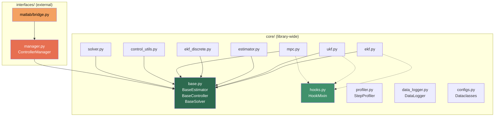

# Implementation Plan: PyControls Integration Architecture

> **Design Principle**: Every addition must satisfy at least one of:
> 1. Improves the library for **all** users
> 2. Makes external integration (MATLAB, ROS, Gazebo) **cleaner**
> 3. Enables **future backends** without core changes
>
> If a feature exists only because "MATLAB might like it", it belongs in the interface layer, not in `core/`.

---

## Table of Contents

- [Architecture Overview](#architecture-overview)
- [Phase 1 — Core Library Hardening](#phase-1--core-library-hardening)
- [Phase 2 — Core Infrastructure](#phase-2--core-infrastructure)
- [Phase 3 — Interface Layer](#phase-3--interface-layer)
- [Phase 4 — Packaging and Verification](#phase-4--packaging-and-verification)
- [Execution Order](#execution-order)
- [Verification Plan](#verification-plan)

---

## Architecture Overview

### Current Structure
```
PyControls/
├── core/           # Algorithms (EKF, UKF, MPC, PID, solvers, math)
├── systems/        # Plant models (DCMotor, Pendulum, Battery, Thermistor)
├── modules/        # Sim infrastructure (InteractiveLab, PhysicsEngine)
├── helpers/        # App-layer (config, plotting, sim runner, registry)
├── tests/          # Test suite
└── main.py         # CLI entry point
```

### Target Structure
```
PyControls/
├── core/
│   ├── base.py              # [NEW] BaseEstimator, BaseController, BaseSolver
│   ├── configs.py           # [NEW] Configuration dataclasses
│   ├── data_logger.py       # [NEW] DataLogger
│   ├── hooks.py             # [NEW] HookMixin (event callback system)
│   ├── profiler.py          # [NEW] StepProfiler
│   ├── __init__.py          # [MODIFY] Export base classes
│   ├── ekf.py               # [MODIFY] Inherit BaseEstimator, add lifecycle methods
│   ├── ekf_discrete.py      # [MODIFY] Inherit BaseEstimator, add lifecycle methods
│   ├── estimator.py         # [MODIFY] Inherit BaseEstimator, add lifecycle methods
│   ├── ukf.py               # [MODIFY] Inherit BaseEstimator, add lifecycle methods
│   ├── mpc.py               # [MODIFY] Inherit BaseController, add lifecycle + hot-swap
│   ├── control_utils.py     # [MODIFY] PIDController inherits BaseController
│   ├── solver.py            # [MODIFY] ExactSolver inherits BaseSolver, add discretize_zoh
│   ├── analysis.py          # [MODIFY] Replace print → logging
│   ├── math_utils.py        # [MODIFY] Replace print → logging
│   ├── state_space.py       # [MODIFY] Replace print → logging
│   ├── exceptions.py        # (unchanged)
│   └── transfer_function.py # (unchanged)
├── interfaces/
│   ├── __init__.py          # [NEW] Package init
│   ├── manager.py           # [NEW] ControllerManager (handle-based registry)
│   └── matlab/
│       ├── __init__.py      # [NEW]
│       └── bridge.py        # [NEW] Thin MATLAB ↔ NumPy type conversion layer
├── systems/                 # (unchanged)
├── modules/                 # (unchanged)
├── helpers/                 # (unchanged)
├── tests/
│   ├── test_base_classes.py      # [NEW]
│   ├── test_lifecycle.py         # [NEW]
│   ├── test_serialization.py     # [NEW]
│   ├── test_manager.py           # [NEW]
│   ├── test_profiler_logger.py   # [NEW]
│   ├── test_matlab_bridge.py     # [NEW]
│   └── (existing tests)          # (unchanged)
├── main.py                  # (unchanged)
└── pyproject.toml           # [MODIFY] Add interfaces* to package discovery
```

### Dependency Diagram



---

## Phase 1 — Core Library Hardening

These changes improve the library for **all users**, independent of any integration.

---

### Component 1: Unified Base Classes

> **Rationale**: External consumers (MATLAB, ROS, Gymnasium) should not need to know whether they're using an EKF, UKF, or Particle Filter. A unified interface enables polymorphic dispatch and simplifies the ControllerManager.

#### [NEW] [base.py](file:///media/shadow30812/Windows-SSD/Well/Projects/PyControls/core/base.py)

```python
"""
Abstract base classes defining the standard interface for all PyControls components.

These ensure that any estimator, controller, or solver can be used interchangeably
by external integration layers (MATLAB, ROS, Gymnasium, etc.) without knowledge
of the specific algorithm.
"""

from abc import ABC, abstractmethod
from typing import Any, Dict, Optional, Union

import numpy as np
from numpy.typing import ArrayLike, NDArray


class BaseEstimator(ABC):
    """
    Standard interface for all state estimators.

    Subclasses: KalmanFilter, ExtendedKalmanFilter, DiscreteExtendedKalmanFilter,
                UnscentedKalmanFilter.

    All estimators follow the predict-update cycle:
        estimator.predict(u, dt)
        x_hat = estimator.update(y_meas)
    """

    @abstractmethod
    def predict(self, u: Any, dt: Optional[float] = None) -> None:
        """Propagate state estimate forward by one time step."""
        ...

    @abstractmethod
    def update(self, y: Union[ArrayLike, NDArray[Any]]) -> NDArray[np.float64]:
        """Incorporate a measurement and return the updated state estimate."""
        ...

    @abstractmethod
    def get_state(self) -> NDArray[np.float64]:
        """Return the current state estimate as a flat 1-D array."""
        ...

    @abstractmethod
    def get_covariance(self) -> NDArray[np.float64]:
        """Return a copy of the current error covariance matrix."""
        ...

    @abstractmethod
    def reset(self, x0: ArrayLike, P0: Optional[ArrayLike] = None) -> None:
        """Reset state and covariance for a new estimation session."""
        ...

    def save_state(self) -> Dict[str, Any]:
        """Serialize runtime state for checkpointing/replay."""
        return {
            "class": type(self).__name__,
            "state": self.get_state().tolist(),
            "covariance": self.get_covariance().tolist(),
        }

    def load_state(self, state_dict: Dict[str, Any]) -> None:
        """Restore runtime state from a saved checkpoint."""
        self.reset(
            np.array(state_dict["state"]),
            np.array(state_dict["covariance"]),
        )


class BaseController(ABC):
    """
    Standard interface for all controllers.

    Subclasses: PIDController, ModelPredictiveControl.

    All controllers expose a unified compute() method:
        u = controller.compute(state, reference, dt)
    """

    @abstractmethod
    def compute(
        self,
        state: NDArray[np.float64],
        reference: NDArray[np.float64],
        dt: float,
    ) -> NDArray[np.float64]:
        """Compute control output given current state and reference."""
        ...

    @abstractmethod
    def reset(self) -> None:
        """Clear internal state (integral terms, warm-starts, etc.)."""
        ...

    def save_state(self) -> Dict[str, Any]:
        """Serialize controller runtime state."""
        return {"class": type(self).__name__}

    def load_state(self, state_dict: Dict[str, Any]) -> None:
        """Restore controller state from checkpoint."""
        self.reset()


class BaseSolver(ABC):
    """
    Standard interface for all discrete-time solvers.

    Subclasses: ExactSolver.
    """

    @abstractmethod
    def step(self, u: Any) -> Union[float, NDArray[np.float64]]:
        """Advance the system by one discrete time step."""
        ...

    @abstractmethod
    def reset(self) -> None:
        """Reset solver state to initial conditions."""
        ...

    def save_state(self) -> Dict[str, Any]:
        """Serialize solver runtime state."""
        return {"class": type(self).__name__}

    def load_state(self, state_dict: Dict[str, Any]) -> None:
        """Restore solver state from checkpoint."""
        self.reset()
```

---

### Component 2: Estimator Lifecycle Methods

Add `reset()`, `get_state()`, `get_covariance()`, `save_state()`, `load_state()` to all four estimators. Make each inherit from `BaseEstimator`.

---

#### [MODIFY] [estimator.py](file:///media/shadow30812/Windows-SSD/Well/Projects/PyControls/core/estimator.py)

**Change 1** — Add import and change class declaration (L1–L7):

```diff
-from typing import Any, Final, Optional, Union
+from typing import Any, Dict, Final, Optional, Union

 import numpy as np
 from numpy.typing import ArrayLike, NDArray

+from core.base import BaseEstimator

-class KalmanFilter:
+class KalmanFilter(BaseEstimator):
```

**Change 2** — Add methods after `update()` (after L92):

```python
    def get_state(self) -> NDArray[np.float64]:
        """Returns the current state estimate as a flat array."""
        return self.x_hat.flatten()

    def get_covariance(self) -> NDArray[np.float64]:
        """Returns a copy of the current error covariance matrix."""
        return self.P.copy()

    def reset(self, x0: ArrayLike, P0: Optional[ArrayLike] = None) -> None:
        """Resets filter state. Useful for Simulink scenario restarts."""
        self.x_hat = np.array(x0, dtype=float).reshape(-1, 1)
        if P0 is not None:
            self.P = np.array(P0, dtype=float)
        else:
            self.P = np.eye(self.x_hat.shape[0]) * 0.1
```

> [!NOTE]
> `predict()` already has signature `predict(self, u, _=None)` which satisfies `BaseEstimator.predict(self, u, dt=None)`. No signature change needed.

---

#### [MODIFY] [ekf.py](file:///media/shadow30812/Windows-SSD/Well/Projects/PyControls/core/ekf.py)

**Change 1** — Add import and inherit (L1–L7):

```diff
-from typing import Any, Callable, Optional, Union
+from typing import Any, Callable, Dict, Optional, Union

 import numpy as np
 from numpy.typing import ArrayLike, NDArray

+from core.base import BaseEstimator

-class ExtendedKalmanFilter:
+class ExtendedKalmanFilter(BaseEstimator):
```

**Change 2** — Add methods after `update()` (after L145):

```python
    def get_state(self) -> NDArray[np.float64]:
        return self.x_hat.flatten()

    def get_covariance(self) -> NDArray[np.float64]:
        return self.P.copy()

    def reset(self, x0: ArrayLike, P0: Optional[ArrayLike] = None) -> None:
        self.x_hat = np.array(x0, dtype=float).reshape(-1, 1)
        self.n = self.x_hat.shape[0]
        if P0 is not None:
            self.P = np.array(P0, dtype=float)
        else:
            self.P = np.eye(self.n) * 0.1
        self._I_complex = np.eye(self.n, dtype=complex)
```

---

#### [MODIFY] [ekf_discrete.py](file:///media/shadow30812/Windows-SSD/Well/Projects/PyControls/core/ekf_discrete.py)

**Change 1** — Add import and inherit (L1–L10):

```diff
-from typing import Any, Callable, Final, Optional, Union
+from typing import Any, Callable, Dict, Final, Optional, Union

 import numpy as np
 from numpy.typing import ArrayLike, NDArray

 from core.math_utils import jacobian
 from core.solver import manual_matrix_exp
+from core.base import BaseEstimator

-class DiscreteExtendedKalmanFilter:
+class DiscreteExtendedKalmanFilter(BaseEstimator):
```

**Change 2** — Add methods after `update()` (after L60):

```python
    def get_state(self) -> NDArray[np.float64]:
        return self.x.flatten()

    def get_covariance(self) -> NDArray[np.float64]:
        return self.P.copy()

    def reset(self, x0: ArrayLike, P0: Optional[ArrayLike] = None) -> None:
        self.x = np.atleast_2d(x0).astype(float).T
        if P0 is not None:
            self.P = np.array(P0, dtype=float)
        else:
            self.P = np.eye(self.x.shape[0])
```

> [!NOTE]
> `DiscreteExtendedKalmanFilter.predict(self, u=None)` takes only `u` with no `dt` argument. The base class signature is `predict(self, u, dt=None)` — since `dt` defaults to `None`, the existing call pattern `ekf.predict(u)` still works. However, the method signature must be updated to `predict(self, u=None, dt=None)` to match the ABC. The internal body ignores `dt` (it uses `self.dt` from construction).

**Change 3** — Update `predict` signature (L38):

```diff
-    def predict(self, u: Optional[Union[float, NDArray[np.float64]]] = None) -> None:
+    def predict(self, u: Optional[Union[float, NDArray[np.float64]]] = None, dt: Optional[float] = None) -> None:
```

Body is unchanged — `dt` parameter is accepted but ignored (discretisation baked in at construction via `self.dt`).

---

#### [MODIFY] [ukf.py](file:///media/shadow30812/Windows-SSD/Well/Projects/PyControls/core/ukf.py)

**Change 1** — Add import and inherit (L1–L7):

```diff
-from typing import Any, Callable, Final, Union
+from typing import Any, Callable, Dict, Final, Optional, Union

 import numpy as np
 from numpy.typing import ArrayLike, NDArray

+from core.base import BaseEstimator

-class UnscentedKalmanFilter:
+class UnscentedKalmanFilter(BaseEstimator):
```

**Change 2** — Add methods after `update()` (after L153):

```python
    def get_state(self) -> NDArray[np.float64]:
        return self.x.copy()

    def get_covariance(self) -> NDArray[np.float64]:
        return self.P.copy()

    def reset(self, x0: ArrayLike, P0: Optional[ArrayLike] = None) -> None:
        self.x = np.array(x0, dtype=float)
        n_new = len(self.x)
        if n_new != self.n:
            # Bypass Final annotation at runtime for dimension change
            object.__setattr__(self, "n", n_new)
            self.lam = self.alpha**2 * (self.n + self.kappa) - self.n
            self._compute_weights()
        if P0 is not None:
            self.P = np.array(P0, dtype=float)
        else:
            self.P = np.eye(self.n) * 0.1
```

---

### Component 3: Controller Lifecycle Methods

Make `PIDController` and `ModelPredictiveControl` inherit from `BaseController`. Add the unified `compute()` method, MPC reset/hot-swap, and serialization.

---

#### [MODIFY] [control_utils.py](file:///media/shadow30812/Windows-SSD/Well/Projects/PyControls/core/control_utils.py)

**Change 1** — Add import and inherit (top of file, L1–L4, and L188):

```diff
-from typing import List, Optional, Tuple, Union
+from typing import Any, Dict, List, Optional, Tuple, Union

 import numpy as np
 from numpy.typing import ArrayLike, NDArray

+from core.base import BaseController
```

```diff
-class PIDController:
+class PIDController(BaseController):
```

**Change 2** — Add `compute()` method after `update()` (after L303):

```python
    def compute(
        self,
        state: NDArray[np.float64],
        reference: NDArray[np.float64],
        dt: float,
    ) -> NDArray[np.float64]:
        """
        Unified controller interface. Extracts scalar measurement/setpoint
        from state/reference vectors and returns control as 1-D array.
        """
        measurement = float(state.flat[0])
        setpoint = float(reference.flat[0])
        u = self.update(measurement, setpoint, dt)
        return np.array([u])

    def save_state(self) -> Dict[str, Any]:
        return {
            "class": "PIDController",
            "integral_error": self.integral_error,
            "prev_value": self.prev_value,
            "prev_derivative": self.prev_derivative,
            "Kp": self.Kp,
            "Ki": self.Ki,
            "Kd": self.Kd,
        }

    def load_state(self, state_dict: Dict[str, Any]) -> None:
        self.integral_error = state_dict.get("integral_error", 0.0)
        self.prev_value = state_dict.get("prev_value", 0.0)
        self.prev_derivative = state_dict.get("prev_derivative", 0.0)
```

---

#### [MODIFY] [mpc.py](file:///media/shadow30812/Windows-SSD/Well/Projects/PyControls/core/mpc.py)

**Change 1** — Imports: add base class, config decoupling, logging (L1–L8):

```diff
-from typing import Any, Callable, Final, List, Optional, Tuple, TypeAlias, Union, cast
+from typing import Any, Callable, Dict, Final, List, Optional, Tuple, TypeAlias, Union, cast
+import logging

 import numpy as np
 from numpy.typing import ArrayLike, NDArray

-from helpers.config import MPC_SOLVER_PARAMS
+from core.base import BaseController
+
+try:
+    from helpers.config import MPC_SOLVER_PARAMS
+except ImportError:
+    MPC_SOLVER_PARAMS: Dict[str, Any] = {
+        "rho": 1.0,
+        "finite_diff_eps": 1e-5,
+        "ilqr_reg": 1.0,
+        "ilqr_alphas": [1.0, 0.5, 0.25, 0.1],
+        "default_linear_iters": 50,
+        "default_nonlinear_iters": 10,
+        "ilqr_tol": 1e-3,
+        "mpc_stride": 3,
+    }
+
+logger = logging.getLogger(__name__)

 NumericArray: TypeAlias = Union[NDArray[np.float64], NDArray[np.complex128]]
```

**Change 2** — Inherit BaseController (L11):

```diff
-class ModelPredictiveControl:
+class ModelPredictiveControl(BaseController):
```

**Change 3** — Remove `Final` from `u_min`, `u_max`, `Q`, `R` (L53–L73):

```diff
-        self.u_min: Final[Union[float, NDArray[np.float64]]] = u_min
-        self.u_max: Final[Union[float, NDArray[np.float64]]] = u_max
+        self.u_min: Union[float, NDArray[np.float64]] = u_min
+        self.u_max: Union[float, NDArray[np.float64]] = u_max
```

```diff
-        self.Q: Final[NDArray[np.float64]] = (
+        self.Q: NDArray[np.float64] = (
             np.eye(self.x_dim) if Q is None else np.array(Q, dtype=float)
         )
-        self.R: Final[NDArray[np.float64]] = (
+        self.R: NDArray[np.float64] = (
             np.eye(self.u_dim) if R is None else np.array(R, dtype=float)
         )
```

**Change 4** — Replace print statements with logging (L76, L82–L84):

```diff
-            print("\nMPC: Linear matrices detected. Using ADMM solver.\n")
+            logger.debug("MPC: Linear matrices detected. Using ADMM solver.")
```

```diff
-            print(
-                "\nMPC: No linear matrices. Using iLQR solver for nonlinear dynamics.\n"
-            )
+            logger.debug("MPC: No linear matrices. Using iLQR solver for nonlinear dynamics.")
```

**Change 5** — Add new methods after `optimize()` (after L367):

```python
    def compute(
        self,
        state: NDArray[np.float64],
        reference: NDArray[np.float64],
        dt: float,
    ) -> NDArray[np.float64]:
        """
        Unified controller interface. Wraps optimize().
        Args dt is unused (MPC uses self.dt), but accepted for interface compliance.
        """
        return self.optimize(state, reference)

    def reset(self) -> None:
        """Clears warm-start trajectories and gains. Call between scenarios."""
        self.u_seq[:] = 0.0
        self._x_seq[:] = 0.0
        self._k[:] = 0.0
        self._K[:] = 0.0
        self._A_seq[:] = 0.0
        self._B_seq[:] = 0.0
        if hasattr(self, "_prev_k_norm"):
            del self._prev_k_norm

    def set_constraints(
        self,
        u_min: Union[float, NDArray[np.float64]],
        u_max: Union[float, NDArray[np.float64]],
    ) -> None:
        """Updates control input bounds. Safe to call between optimization steps."""
        self.u_min = u_min
        self.u_max = u_max

    def set_weights(
        self,
        Q: Optional[ArrayLike] = None,
        R: Optional[ArrayLike] = None,
    ) -> None:
        """
        Updates cost matrices.

        For linear-mode MPC, this triggers _setup_admm() to recompute condensed
        QP matrices. This is a one-time cost (~1 ms for typical systems).
        Do NOT call inside a tight control loop.
        """
        if Q is not None:
            self.Q = np.array(Q, dtype=float)
        if R is not None:
            self.R = np.array(R, dtype=float)
        if self.mode == "linear":
            self._setup_admm()

    def save_state(self) -> Dict[str, Any]:
        return {
            "class": "ModelPredictiveControl",
            "u_seq": self.u_seq.tolist(),
            "x_seq": self._x_seq.tolist(),
            "mode": self.mode,
        }

    def load_state(self, state_dict: Dict[str, Any]) -> None:
        self.u_seq = np.array(state_dict["u_seq"], dtype=float)
        self._x_seq = np.array(state_dict["x_seq"], dtype=float)
```

---

### Component 4: Solver Lifecycle

Make `ExactSolver` inherit `BaseSolver`. Add `discretize_zoh()` as a standalone function. Add `save_state`/`load_state`.

---

#### [MODIFY] [solver.py](file:///media/shadow30812/Windows-SSD/Well/Projects/PyControls/core/solver.py)

**Change 1** — Config decoupling + base class import (L1–L6):

```diff
-from typing import Any, Callable, Tuple, Union
+from typing import Any, Callable, Dict, Optional, Tuple, Union

 import numpy as np
 from numpy.typing import ArrayLike, NDArray

-from helpers.config import SOLVER_PARAMS
+from core.base import BaseSolver
+
+try:
+    from helpers.config import SOLVER_PARAMS
+except ImportError:
+    SOLVER_PARAMS: Dict[str, Any] = {
+        "matrix_exp_order": 20,
+        "adaptive_dt_min": 1e-5,
+        "adaptive_dt_max": 0.5,
+        "adaptive_tol": 1e-6,
+        "adaptive_initial_dt": 0.001,
+        "safety_factor_1": 0.9,
+        "safety_factor_2": 0.2,
+    }
```

**Change 2** — Add `discretize_zoh()` function before `ExactSolver` class (before L88):

```python
def discretize_zoh(
    A: ArrayLike, B: ArrayLike, dt: float
) -> Tuple[NDArray[np.float64], NDArray[np.float64]]:
    """
    Discretises continuous-time (A, B) matrices using Zero-Order Hold.

    Computes the matrix exponential of [A B; 0 0] * dt and extracts
    the discrete-time (Phi, Gamma) pair.

    Args:
        A: Continuous-time state matrix (n x n).
        B: Continuous-time input matrix (n x m).
        dt: Sample period in seconds.

    Returns:
        Tuple of (Phi, Gamma) — the discrete-time state and input matrices.
    """
    A_arr = np.atleast_2d(A)
    B_arr = np.atleast_2d(B)
    n_states = A_arr.shape[0]
    n_inputs = B_arr.shape[1]

    M = np.zeros((n_states + n_inputs, n_states + n_inputs))
    M[:n_states, :n_states] = A_arr
    M[:n_states, n_states:] = B_arr

    M_exp = manual_matrix_exp(M * dt)
    return M_exp[:n_states, :n_states], M_exp[:n_states, n_states:]
```

**Change 3** — `ExactSolver` inherits `BaseSolver` and uses `discretize_zoh` (L88, L112–L118):

```diff
-class ExactSolver:
+class ExactSolver(BaseSolver):
```

```diff
-        top: NDArray[np.float64] = np.hstack((self.A, self.B))
-        bottom: NDArray[np.float64] = np.zeros((n_inputs, n_states + n_inputs))
-        M: NDArray[np.float64] = np.vstack((top, bottom))
-
-        M_exp: NDArray[np.float64] = manual_matrix_exp(M * dt)
-        self.Phi: NDArray[np.float64] = M_exp[:n_states, :n_states]
-        self.Gamma: NDArray[np.float64] = M_exp[:n_states, n_states:]
+        self.Phi, self.Gamma = discretize_zoh(self.A, self.B, dt)
```

**Change 4** — Add serialization after `reset()` (after L141):

```python
    def save_state(self) -> Dict[str, Any]:
        return {
            "class": "ExactSolver",
            "x": self.x.flatten().tolist(),
        }

    def load_state(self, state_dict: Dict[str, Any]) -> None:
        self.x = np.array(state_dict["x"], dtype=float).reshape(-1, 1)
```

---

### Component 5: Config Decoupling

Already handled inline in Component 3 (mpc.py) and Component 4 (solver.py) above via `try/except ImportError` with inlined fallback defaults.

---

### Component 6: Stdout Cleanup (Logging)

Replace all `print()` calls in `core/` with Python's `logging` module. MPC logging is already handled in Component 3.

---

#### [MODIFY] [ekf.py](file:///media/shadow30812/Windows-SSD/Well/Projects/PyControls/core/ekf.py)

Add at top: `import logging` and `logger = logging.getLogger(__name__)`

| Line | Current | Replacement |
|------|---------|-------------|
| L135–L138 | `print("Np LinAlg error in core/ekf/...")` | `logger.warning("LinAlg error in EKF update; using zero gain fallback.")` |

---

#### [MODIFY] [state_space.py](file:///media/shadow30812/Windows-SSD/Well/Projects/PyControls/core/state_space.py)

Add at top: `import logging` and `logger = logging.getLogger(__name__)`

| Line | Current | Replacement |
|------|---------|-------------|
| L129–L131 | `print("Np LinAlg error in core/state_space/...")` | `logger.warning("LinAlg error in frequency response at ω=%s", w)` |

---

#### [MODIFY] [math_utils.py](file:///media/shadow30812/Windows-SSD/Well/Projects/PyControls/core/math_utils.py)

Add at top: `import logging` and `logger = logging.getLogger(__name__)`

| Lines | Current `print()` | Replacement |
|-------|---------|-------------|
| L53–L58 | `print("Error in core/math_utils/make_func/f", e, ...)` | `logger.warning("Error evaluating expression: %s", e)` |
| L90–L95 | `print("Error in core/math_utils/make_system_func/f", e, ...)` | `logger.warning("Error evaluating system expression: %s", e)` |
| L116–L121 | `print("Could not differentiate: ...", e, ...)` | `logger.warning("Differentiation fallback failed: %s", e)` |
| L304 | `print("Error in Brent's root")` | `logger.debug("Brent's method failed; falling back to Newton.")` |
| L309 | `print("Error in Newton's root")` | `logger.warning("Newton's method also failed; returning initial guess.")` |

---

#### [MODIFY] [analysis.py](file:///media/shadow30812/Windows-SSD/Well/Projects/PyControls/core/analysis.py)

Add at top: `import logging` and `logger = logging.getLogger(__name__)`

| Lines | Current `print()` | Replacement |
|-------|---------|-------------|
| L66–L70 | `print("Warning! w_pc set to zero ...", e, ...)` | `logger.debug("Phase crossover search failed: %s", e)` |
| L89–L93 | `print("Warning! w_gc set to zero ...", e, ...)` | `logger.debug("Gain crossover search failed: %s", e)` |

---

## Phase 2 — Core Infrastructure

New modules that improve the library for all users: configuration system, hooks, profiler, and data logger.

---

### Component 7: Configuration Dataclasses

> **Rationale**: Constructors with 10+ positional parameters are error-prone in any language. Dataclasses are natively serializable, self-documenting, and can be loaded from JSON/YAML.

#### [NEW] [configs.py](file:///media/shadow30812/Windows-SSD/Well/Projects/PyControls/core/configs.py)

```python
"""
Configuration dataclasses for PyControls components.

Usage:
    cfg = EKFConfig(Q=..., R=..., x0=...)
    ekf = ExtendedKalmanFilter.from_config(f, h, cfg)

    # Or load from JSON:
    import json
    with open("ekf_config.json") as f:
        cfg = EKFConfig(**json.load(f))
"""

from dataclasses import dataclass, field
from typing import Any, Dict, List, Optional, Tuple, Union

import numpy as np
from numpy.typing import ArrayLike


@dataclass
class EKFConfig:
    """Configuration for ExtendedKalmanFilter."""
    Q: ArrayLike = field(default_factory=lambda: np.eye(1))
    R: ArrayLike = field(default_factory=lambda: np.eye(1))
    x0: ArrayLike = field(default_factory=lambda: np.zeros(1))
    p_init_scale: float = 0.1


@dataclass
class UKFConfig:
    """Configuration for UnscentedKalmanFilter."""
    Q: ArrayLike = field(default_factory=lambda: np.eye(1))
    R: ArrayLike = field(default_factory=lambda: np.eye(1))
    x0: ArrayLike = field(default_factory=lambda: np.zeros(1))
    P0: ArrayLike = field(default_factory=lambda: np.eye(1))
    alpha: float = 1e-3
    beta: float = 2.0
    kappa: float = 0.0


@dataclass
class PIDConfig:
    """Configuration for PIDController."""
    Kp: float = 1.0
    Ki: float = 0.0
    Kd: float = 0.0
    derivative_on_measurement: bool = True
    output_limits: Tuple[Optional[float], Optional[float]] = (None, None)
    integral_limits: Tuple[Optional[float], Optional[float]] = (None, None)
    tau: float = 0.02


@dataclass
class MPCConfig:
    """Configuration for ModelPredictiveControl."""
    horizon: int = 10
    dt: float = 0.1
    Q: Optional[ArrayLike] = None
    R: Optional[ArrayLike] = None
    u_min: float = -10.0
    u_max: float = 10.0


@dataclass
class SolverConfig:
    """Configuration for ExactSolver."""
    dt: float = 0.01
```

> [!NOTE]
> These dataclasses are **optional sugar** — all existing constructors continue to work with positional/keyword arguments. A `from_config(cfg)` classmethod can be added to each class later if desired, but is not required for Phase 1.

---

### Component 8: Event/Callback Hooks

> **Rationale**: Even as empty stubs, hooks define extension points for logging, monitoring, and debugging without modifying core logic. "Later they become invaluable."

#### [NEW] [hooks.py](file:///media/shadow30812/Windows-SSD/Well/Projects/PyControls/core/hooks.py)

```python
"""
Event callback system for PyControls components.

Provides a mixin class that any estimator, controller, or solver can inherit
to support pre/post-step callbacks without modifying core algorithm logic.

Usage:
    ekf = ExtendedKalmanFilter(...)
    ekf.register_hook("on_update_end", lambda **kw: print(f"x_hat = {kw['state']}"))
"""

from typing import Any, Callable, Dict, FrozenSet, List


class HookMixin:
    """Mixin that adds event hook support to any class."""

    VALID_EVENTS: FrozenSet[str] = frozenset({
        "on_predict_begin",
        "on_predict_end",
        "on_update_begin",
        "on_update_end",
        "on_compute_begin",
        "on_compute_end",
        "on_reset",
        "on_convergence",
        "on_divergence",
    })

    def _init_hooks(self) -> None:
        """Call this in __init__ of any class using HookMixin."""
        self._hooks: Dict[str, List[Callable[..., None]]] = {
            event: [] for event in self.VALID_EVENTS
        }

    def register_hook(self, event: str, callback: Callable[..., None]) -> None:
        """Register a callback for a specific event."""
        if event not in self.VALID_EVENTS:
            raise ValueError(
                f"Unknown event '{event}'. Valid events: {sorted(self.VALID_EVENTS)}"
            )
        if not hasattr(self, "_hooks"):
            self._init_hooks()
        self._hooks[event].append(callback)

    def unregister_hook(self, event: str, callback: Callable[..., None]) -> None:
        """Remove a previously registered callback."""
        if hasattr(self, "_hooks") and event in self._hooks:
            self._hooks[event].remove(callback)

    def _fire(self, event: str, **kwargs: Any) -> None:
        """Fire all callbacks registered for an event. No-op if no hooks registered."""
        if not hasattr(self, "_hooks"):
            return
        for cb in self._hooks.get(event, []):
            cb(**kwargs)
```

> [!IMPORTANT]
> **Integration with estimators/controllers**: The `_fire()` calls are NOT added to predict/update/compute methods in this plan. They are stubs only. A future PR can add `self._fire("on_predict_begin", u=u, dt=dt)` etc. at the top/bottom of each method. This keeps the current plan focused on the API surface.

---

### Component 9: Performance Profiler

#### [NEW] [profiler.py](file:///media/shadow30812/Windows-SSD/Well/Projects/PyControls/core/profiler.py)

```python
"""
Lightweight profiler for real-time control loops.

Usage:
    prof = StepProfiler()

    with prof.measure("ekf_predict"):
        ekf.predict(u, dt)

    with prof.measure("mpc_optimize"):
        u = mpc.optimize(x, x_ref)

    print(prof.summary())
    # {'ekf_predict': {'count': 100, 'mean_us': 47.2, 'max_us': 112.0, ...},
    #  'mpc_optimize': {'count': 100, 'mean_us': 284.5, 'max_us': 510.0, ...}}
"""

import time
from collections import defaultdict
from contextlib import contextmanager
from typing import Dict, Generator, List


class StepProfiler:
    """Measures per-step timing of control loop components."""

    def __init__(self, enabled: bool = True) -> None:
        self._enabled = enabled
        self._timings: Dict[str, List[float]] = defaultdict(list)

    @contextmanager
    def measure(self, label: str) -> Generator[None, None, None]:
        """Context manager that records elapsed time in microseconds."""
        if not self._enabled:
            yield
            return
        t0 = time.perf_counter_ns()
        yield
        elapsed_us = (time.perf_counter_ns() - t0) / 1_000.0
        self._timings[label].append(elapsed_us)

    def record(self, label: str, duration_us: float) -> None:
        """Manually record a timing measurement."""
        if self._enabled:
            self._timings[label].append(duration_us)

    def summary(self) -> Dict[str, Dict[str, float]]:
        """Return statistics for each label: count, mean, min, max, last (all in µs)."""
        result: Dict[str, Dict[str, float]] = {}
        for label, times in self._timings.items():
            if not times:
                continue
            result[label] = {
                "count": len(times),
                "mean_us": sum(times) / len(times),
                "min_us": min(times),
                "max_us": max(times),
                "last_us": times[-1],
            }
        return result

    def reset(self) -> None:
        """Clear all recorded timings."""
        self._timings.clear()

    @property
    def enabled(self) -> bool:
        return self._enabled

    @enabled.setter
    def enabled(self, value: bool) -> None:
        self._enabled = value
```

---

### Component 10: Data Logger

#### [NEW] [data_logger.py](file:///media/shadow30812/Windows-SSD/Well/Projects/PyControls/core/data_logger.py)

```python
"""
Backend-independent data logging for PyControls simulations.

Records time-series signals (states, inputs, costs, constraints) independent
of any visualization or integration backend.

Usage:
    log = DataLogger()
    log.log_state(x_hat, t=0.01)
    log.log_input(u, t=0.01)
    log.export_npz("run_001.npz")
    log.export_csv("run_001.csv")
"""

import csv
from collections import defaultdict
from typing import Any, Dict, List, Optional, Tuple, Union

import numpy as np
from numpy.typing import NDArray


class DataLogger:
    """Records time-series data from simulation runs."""

    def __init__(self, max_entries: int = 100_000) -> None:
        self._max = max_entries
        self._data: Dict[str, List[Tuple[Optional[float], Any]]] = defaultdict(list)

    def log(self, channel: str, value: Any, t: Optional[float] = None) -> None:
        """Log a value to a named channel."""
        entries = self._data[channel]
        if len(entries) < self._max:
            entries.append((t, value))

    def log_state(self, state: NDArray[Any], t: float) -> None:
        """Log a state vector."""
        self.log("state", state.flatten().tolist(), t)

    def log_input(self, u: Union[float, NDArray[Any]], t: float) -> None:
        """Log a control input."""
        val = u if isinstance(u, (int, float)) else u.flatten().tolist()
        self.log("input", val, t)

    def log_cost(self, cost: float, t: float) -> None:
        """Log an optimization cost value."""
        self.log("cost", cost, t)

    def log_constraint(
        self, violated: bool, details: str, t: float
    ) -> None:
        """Log a constraint evaluation."""
        self.log("constraint", {"violated": violated, "details": details}, t)

    def get(self, channel: str) -> List[Tuple[Optional[float], Any]]:
        """Retrieve all entries from a channel."""
        return self._data.get(channel, [])

    def channels(self) -> List[str]:
        """List all channels that have data."""
        return list(self._data.keys())

    def clear(self) -> None:
        """Clear all logged data."""
        self._data.clear()

    def export_npz(self, path: str, channels: Optional[List[str]] = None) -> None:
        """Export selected channels (or all) as a NumPy .npz archive."""
        targets = channels or list(self._data.keys())
        arrays: Dict[str, NDArray[Any]] = {}
        for ch in targets:
            entries = self._data.get(ch, [])
            if not entries:
                continue
            times = np.array([e[0] for e in entries], dtype=float)
            values = np.array([e[1] for e in entries])
            arrays[f"{ch}_t"] = times
            arrays[f"{ch}_v"] = values
        np.savez(path, **arrays)

    def export_csv(self, path: str, channel: str = "state") -> None:
        """Export a single channel as CSV with timestamp column."""
        entries = self._data.get(channel, [])
        if not entries:
            return
        with open(path, "w", newline="") as f:
            writer = csv.writer(f)
            sample = entries[0][1]
            if isinstance(sample, list):
                header = ["t"] + [f"{channel}_{i}" for i in range(len(sample))]
            else:
                header = ["t", channel]
            writer.writerow(header)
            for t, val in entries:
                if isinstance(val, list):
                    writer.writerow([t] + val)
                else:
                    writer.writerow([t, val])
```

---

## Phase 3 — Interface Layer

This layer provides the integration surface for external systems. The core library knows nothing about MATLAB, ROS, or Gymnasium. Each interface is a thin adapter that converts types and forwards calls.

---

### Component 11: ControllerManager

> **Rationale**: Instead of MATLAB, ROS, or Gymnasium storing raw Python objects, they hold string handles. The manager owns the objects and provides lifecycle operations. This scales to N drones/agents by using namespaced handles like `"drone_1/ekf"`, `"drone_2/mpc"`.

#### [NEW] [manager.py](file:///media/shadow30812/Windows-SSD/Well/Projects/PyControls/interfaces/manager.py)

```python
"""
Handle-based object registry for external integrations.

Provides lifecycle management (register, get, reset, destroy) so that
external systems (MATLAB, ROS, Gymnasium) hold lightweight string handles
instead of raw Python object references.

Multi-agent ready: use namespaced handles like "drone_1/ekf", "drone_2/mpc".
"""

from typing import Any, Dict, List, Optional, Union

from core.base import BaseController, BaseEstimator, BaseSolver

ManagedObject = Union[BaseEstimator, BaseController, BaseSolver]


class ControllerManager:
    """Registry for estimators, controllers, and solvers."""

    def __init__(self) -> None:
        self._registry: Dict[str, ManagedObject] = {}
        self._counter: int = 0

    def register(self, obj: ManagedObject, name: Optional[str] = None) -> str:
        """
        Register an object and return its handle.

        Args:
            obj: Any BaseEstimator, BaseController, or BaseSolver instance.
            name: Optional custom handle. Auto-generated if omitted.

        Returns:
            The string handle used to reference this object.
        """
        if name is None:
            name = f"{type(obj).__name__}_{self._counter}"
            self._counter += 1
        if name in self._registry:
            raise KeyError(f"Handle '{name}' already registered. Use destroy() first.")
        self._registry[name] = obj
        return name

    def get(self, handle: str) -> ManagedObject:
        """Retrieve a registered object by handle."""
        if handle not in self._registry:
            raise KeyError(f"Handle '{handle}' not found. Registered: {list(self._registry.keys())}")
        return self._registry[handle]

    def reset(self, handle: str) -> None:
        """Reset a specific registered object."""
        obj = self.get(handle)
        if isinstance(obj, BaseEstimator):
            # Estimator reset requires x0; re-reset to current state shape
            state = obj.get_state()
            obj.reset(state * 0.0)  # Zero state, keep dimensions
        else:
            obj.reset()

    def reset_all(self) -> None:
        """Reset all registered objects."""
        for handle in list(self._registry.keys()):
            self.reset(handle)

    def destroy(self, handle: str) -> None:
        """Remove an object from the registry."""
        if handle not in self._registry:
            raise KeyError(f"Handle '{handle}' not found.")
        del self._registry[handle]

    def destroy_all(self) -> None:
        """Remove all objects from the registry."""
        self._registry.clear()
        self._counter = 0

    def list_handles(self) -> Dict[str, str]:
        """List all registered handles with their class names."""
        return {k: type(v).__name__ for k, v in self._registry.items()}

    def save_all(self) -> Dict[str, Dict[str, Any]]:
        """Save state of all registered objects that support serialization."""
        states: Dict[str, Dict[str, Any]] = {}
        for handle, obj in self._registry.items():
            if hasattr(obj, "save_state"):
                states[handle] = obj.save_state()
        return states

    def load_all(self, states: Dict[str, Dict[str, Any]]) -> None:
        """Load state into all registered objects from a saved checkpoint."""
        for handle, state_dict in states.items():
            if handle in self._registry and hasattr(self._registry[handle], "load_state"):
                self._registry[handle].load_state(state_dict)

    def step_estimator(
        self, handle: str, u: Any, y: Any, dt: float
    ) -> Any:
        """Convenience: predict + update in one call. Returns updated state."""
        est = self.get(handle)
        if not isinstance(est, BaseEstimator):
            raise TypeError(f"Handle '{handle}' is not an estimator.")
        est.predict(u, dt)
        return est.update(y)

    def step_controller(
        self, handle: str, state: Any, reference: Any, dt: float
    ) -> Any:
        """Convenience: compute control output in one call."""
        ctrl = self.get(handle)
        if not isinstance(ctrl, BaseController):
            raise TypeError(f"Handle '{handle}' is not a controller.")
        return ctrl.compute(state, reference, dt)
```

#### [NEW] [interfaces/\_\_init\_\_.py](file:///media/shadow30812/Windows-SSD/Well/Projects/PyControls/interfaces/__init__.py)

```python
"""
PyControls Integration Interfaces.

Each subdirectory provides a thin adapter for a specific external system:
    interfaces/matlab/    — MATLAB Engine API bridge
    interfaces/ros2/      — (future) ROS 2 node integration
    interfaces/gymnasium/ — (future) OpenAI Gymnasium environment wrapper
    interfaces/hil/       — (future) Hardware-in-the-Loop serial bridge
"""
```

---

### Component 12: MATLAB Bridge

> **Key design**: This is purely a type-conversion layer. No control logic. It converts MATLAB arrays to NumPy, forwards calls to the `ControllerManager`, and converts results back. Any logic that benefits all users belongs in `core/` or `interfaces/manager.py`, not here.

#### [NEW] [bridge.py](file:///media/shadow30812/Windows-SSD/Well/Projects/PyControls/interfaces/matlab/bridge.py)

```python
"""
Thin MATLAB ↔ PyControls bridge.

This module provides the entry point for MATLAB's Python Engine API.
It converts MATLAB arrays to NumPy and forwards all calls to the
ControllerManager. Contains ZERO control logic.

MATLAB usage:
    py.importlib.import_module('interfaces.matlab.bridge');
    h = py.interfaces.matlab.bridge.create_ekf(f, h, Q, R, x0);
    py.interfaces.matlab.bridge.predict(h, u, dt);
    x_hat = double(py.interfaces.matlab.bridge.update(h, y));
"""

from typing import Any, Callable, Dict, Optional, Tuple, Union

import numpy as np
from numpy.typing import ArrayLike, NDArray

from core.control_utils import PIDController, dlqr, solve_discrete_riccati
from core.ekf import ExtendedKalmanFilter
from core.ekf_discrete import DiscreteExtendedKalmanFilter
from core.estimator import KalmanFilter
from core.math_utils import jacobian
from core.mpc import ModelPredictiveControl
from core.solver import ExactSolver, discretize_zoh
from core.ukf import UnscentedKalmanFilter
from interfaces.manager import ControllerManager
from modules.physics_engine import rk4_fixed_step

# Module-level manager instance for MATLAB sessions.
# MATLAB holds string handles, this module owns the objects.
_mgr = ControllerManager()


# ── Factory functions ──────────────────────────────────────────────────────

def create_kf(
    A: ArrayLike, B: ArrayLike, C: ArrayLike,
    Q: ArrayLike, R: ArrayLike, x0: ArrayLike,
    name: Optional[str] = None,
) -> str:
    """Create a Kalman Filter and return its handle."""
    obj = KalmanFilter(
        np.asarray(A), np.asarray(B), np.asarray(C),
        np.asarray(Q), np.asarray(R), x0,
    )
    return _mgr.register(obj, name)


def create_ekf(
    f_dynamics: Callable, h_measurement: Callable,
    Q: ArrayLike, R: ArrayLike, x0: ArrayLike,
    p_init_scale: float = 0.1,
    name: Optional[str] = None,
) -> str:
    """Create an Extended Kalman Filter and return its handle."""
    obj = ExtendedKalmanFilter(
        f_dynamics, h_measurement, np.asarray(Q), np.asarray(R),
        np.asarray(x0), p_init_scale,
    )
    return _mgr.register(obj, name)


def create_discrete_ekf(
    f: Callable, h: Callable,
    Q: ArrayLike, R: ArrayLike, x0: ArrayLike, dt: float,
    name: Optional[str] = None,
) -> str:
    """Create a Discrete Extended Kalman Filter and return its handle."""
    obj = DiscreteExtendedKalmanFilter(f, h, Q, R, x0, dt)
    return _mgr.register(obj, name)


def create_ukf(
    f_dynamics: Callable, h_measurement: Callable,
    Q: ArrayLike, R: ArrayLike,
    x0: ArrayLike, P0: ArrayLike,
    alpha: float = 1e-3, beta: float = 2.0, kappa: float = 0.0,
    name: Optional[str] = None,
) -> str:
    """Create an Unscented Kalman Filter and return its handle."""
    obj = UnscentedKalmanFilter(
        f_dynamics, h_measurement, Q, R, x0, P0,
        alpha=alpha, beta=beta, kappa=kappa,
    )
    return _mgr.register(obj, name)


def create_pid(
    Kp: float, Ki: float, Kd: float,
    output_limits: Tuple[Optional[float], Optional[float]] = (None, None),
    name: Optional[str] = None,
    **kwargs: Any,
) -> str:
    """Create a PID Controller and return its handle."""
    obj = PIDController(Kp, Ki, Kd, output_limits=output_limits, **kwargs)
    return _mgr.register(obj, name)


def create_mpc(
    model_func: Optional[Callable] = None,
    x0: Optional[ArrayLike] = None,
    horizon: int = 10, dt: float = 0.1,
    Q: Optional[ArrayLike] = None, R: Optional[ArrayLike] = None,
    u_min: float = -10.0, u_max: float = 10.0,
    A: Optional[ArrayLike] = None, B: Optional[ArrayLike] = None,
    name: Optional[str] = None,
) -> str:
    """Create an MPC controller and return its handle."""
    obj = ModelPredictiveControl(
        model_func=model_func,
        x0=np.asarray(x0) if x0 is not None else None,
        horizon=horizon, dt=dt, Q=Q, R=R,
        u_min=u_min, u_max=u_max,
        A=np.asarray(A) if A is not None else None,
        B=np.asarray(B) if B is not None else None,
    )
    return _mgr.register(obj, name)


def create_solver(
    A: ArrayLike, B: ArrayLike, C: ArrayLike, D: ArrayLike, dt: float,
    name: Optional[str] = None,
) -> str:
    """Create a ZOH LTI solver and return its handle."""
    obj = ExactSolver(A, B, C, D, dt)
    return _mgr.register(obj, name)


# ── Lifecycle operations ───────────────────────────────────────────────────

def get(handle: str) -> Any:
    """Retrieve the raw Python object (for direct attribute access from MATLAB)."""
    return _mgr.get(handle)

def reset(handle: str) -> None:
    _mgr.reset(handle)

def destroy(handle: str) -> None:
    _mgr.destroy(handle)

def destroy_all() -> None:
    _mgr.destroy_all()

def list_handles() -> Dict[str, str]:
    return _mgr.list_handles()

def save_all() -> Dict[str, Any]:
    return _mgr.save_all()

def load_all(states: Dict[str, Any]) -> None:
    _mgr.load_all(states)


# ── Step operations (type-converting wrappers) ─────────────────────────────

def predict(handle: str, u: Any, dt: float) -> None:
    """Estimator predict step (MATLAB array → NumPy conversion)."""
    _mgr.get(handle).predict(np.asarray(u), float(dt))

def update(handle: str, y: Any) -> NDArray[np.float64]:
    """Estimator update step. Returns state estimate as NumPy array."""
    est = _mgr.get(handle)
    est.update(np.asarray(y))
    return est.get_state()

def estimate(handle: str, u: Any, y: Any, dt: float) -> NDArray[np.float64]:
    """Combined predict + update. Returns state estimate."""
    return _mgr.step_estimator(handle, np.asarray(u), np.asarray(y), float(dt))

def control(handle: str, state: Any, reference: Any, dt: float) -> NDArray[np.float64]:
    """Controller compute step. Returns control output."""
    return _mgr.step_controller(
        handle, np.asarray(state), np.asarray(reference), float(dt),
    )

def solver_step(handle: str, u: Any) -> Any:
    """Solver step. Returns output."""
    return _mgr.get(handle).step(np.asarray(u))


# ── Stateless utilities (no handle needed) ──────────────────────────────────

def compute_lqr(A: ArrayLike, B: ArrayLike, Q: ArrayLike, R: ArrayLike) -> NDArray:
    return dlqr(np.asarray(A), np.asarray(B), np.asarray(Q), np.asarray(R))

def compute_dare(A: ArrayLike, B: ArrayLike, Q: ArrayLike, R: ArrayLike) -> NDArray:
    return solve_discrete_riccati(A, B, Q, R)

def compute_jacobian(func: Callable, x: ArrayLike, *args: Any) -> NDArray:
    return jacobian(func, np.asarray(x), *args)

def compute_discretize_zoh(A: ArrayLike, B: ArrayLike, dt: float) -> Tuple[NDArray, NDArray]:
    return discretize_zoh(A, B, dt)

def integrate_rk4(dynamics_func: Callable, x: ArrayLike, u: Any, dt: float, params: dict, disturbance: float = 0.0) -> NDArray:
    return rk4_fixed_step(dynamics_func, np.asarray(x), u, dt, params, disturbance)
```

#### [NEW] [interfaces/matlab/\_\_init\_\_.py](file:///media/shadow30812/Windows-SSD/Well/Projects/PyControls/interfaces/matlab/__init__.py)

```python
"""MATLAB/Simulink integration for PyControls."""
```

---

## Phase 4 — Packaging and Verification

---

### Component 13: Package Configuration

#### [MODIFY] [pyproject.toml](file:///media/shadow30812/Windows-SSD/Well/Projects/PyControls/pyproject.toml)

```diff
 [tool.setuptools.packages.find]
 where = ["."]
-include = ["core*", "systems*"]
+include = ["core*", "systems*", "interfaces*"]
```

---

### Component 14: Thread Safety Documentation

#### [MODIFY] [core/\_\_init\_\_.py](file:///media/shadow30812/Windows-SSD/Well/Projects/PyControls/core/__init__.py)

Replace contents with:

```python
"""
PyControls Core — Algorithmic kernel for estimation, control, and simulation.

Thread Safety
-------------
All stateful classes (KalmanFilter, ExtendedKalmanFilter, UnscentedKalmanFilter,
PIDController, ModelPredictiveControl, ExactSolver) are **NOT thread-safe** when
sharing a single instance across threads. Each thread must use its own instance.

The ControllerManager in interfaces/manager.py is also not thread-safe by default.
For multi-threaded use, either:
  1. Use one ControllerManager per thread, or
  2. Wrap manager calls with a threading.Lock.

Stateless classes (TransferFunction, StateSpace, Check, Root, Differentiation)
are safe to share across threads.
"""
```

---

### Component 15: Test Suite

#### [NEW] [tests/test_base_classes.py](file:///media/shadow30812/Windows-SSD/Well/Projects/PyControls/tests/test_base_classes.py)

Tests to implement:
- Verify `KalmanFilter` is instance of `BaseEstimator`
- Verify `ExtendedKalmanFilter` is instance of `BaseEstimator`
- Verify `DiscreteExtendedKalmanFilter` is instance of `BaseEstimator`
- Verify `UnscentedKalmanFilter` is instance of `BaseEstimator`
- Verify `PIDController` is instance of `BaseController`
- Verify `ModelPredictiveControl` is instance of `BaseController`
- Verify `ExactSolver` is instance of `BaseSolver`

#### [NEW] [tests/test_lifecycle.py](file:///media/shadow30812/Windows-SSD/Well/Projects/PyControls/tests/test_lifecycle.py)

Tests to implement:
- **Estimator reset** (one per type): Create → run 10 steps → `reset(x0)` → verify `get_state()` equals `x0`, covariance is reset
- **Estimator get_state/get_covariance**: Verify `get_state()` returns flat array, `get_covariance()` returns copy (mutating return doesn't affect filter)
- **PID reset**: Create → run → `reset()` → verify `integral_error == 0`
- **MPC reset**: Create → `optimize()` 5× → `reset()` → verify `u_seq` is zeros
- **MPC set_constraints**: `set_constraints(-5, 5)` → `optimize()` → verify output within bounds
- **MPC set_weights**: For linear MPC, `set_weights(new_Q, new_R)` → verify ADMM matrices recomputed

#### [NEW] [tests/test_serialization.py](file:///media/shadow30812/Windows-SSD/Well/Projects/PyControls/tests/test_serialization.py)

Tests to implement:
- **Round-trip** (per type): Create → run 10 steps → `save_state()` → `reset()` → `load_state(saved)` → verify `get_state()` matches pre-save state
- **PID save/load**: Verify integral error survives round-trip
- **MPC save/load**: Verify warm-start trajectory survives round-trip
- **ExactSolver save/load**: Verify internal `x` survives round-trip

#### [NEW] [tests/test_manager.py](file:///media/shadow30812/Windows-SSD/Well/Projects/PyControls/tests/test_manager.py)

Tests to implement:
- **Register/get**: Create PID → register → get by handle → verify same object
- **Duplicate handle**: Register → register same name → expect `KeyError`
- **Destroy**: Register → destroy → get → expect `KeyError`
- **List handles**: Register 3 objects → `list_handles()` → verify names and types
- **Step estimator**: Register KF → `step_estimator(handle, u, y, dt)` → verify state changed
- **Step controller**: Register PID → `step_controller(handle, state, ref, dt)` → verify output
- **Save/load all**: Register 3 objects → run steps → `save_all()` → `reset_all()` → `load_all()` → verify states restored
- **Multi-agent**: Register `"drone_1/ekf"` and `"drone_2/ekf"` → verify independent handles

#### [NEW] [tests/test_profiler_logger.py](file:///media/shadow30812/Windows-SSD/Well/Projects/PyControls/tests/test_profiler_logger.py)

Tests to implement:
- **Profiler**: `measure("test")` 100× → `summary()` → verify count=100, mean > 0
- **Profiler disabled**: `enabled=False` → `measure()` → verify empty summary
- **Logger log/get**: `log("ch", 42, t=1.0)` → `get("ch")` → verify `[(1.0, 42)]`
- **Logger export_npz**: Log 100 states → `export_npz()` → load and verify shape
- **Logger export_csv**: Log 100 states → `export_csv()` → read and verify content
- **Logger max_entries**: `max_entries=10` → log 20 → verify only 10 stored

#### [NEW] [tests/test_matlab_bridge.py](file:///media/shadow30812/Windows-SSD/Well/Projects/PyControls/tests/test_matlab_bridge.py)

Tests to implement:
- **Import test**: `import interfaces.matlab.bridge` → no error
- **Create/destroy cycle**: `create_pid(1,0,0)` → `control(handle, state, ref, dt)` → `destroy(handle)` → `list_handles()` empty
- **Config decoupling**: Import `core.mpc` and `core.solver` with `helpers` removed from `sys.path` → verify no `ImportError`
- **Logging silence**: Create linear MPC with default logging level → verify no stdout output

---

## Execution Order

Changes must be applied in this sequence due to import dependencies:

| Step | Component | Files | Rationale |
|------|-----------|-------|-----------|
| 1 | Base classes | `core/base.py` [NEW] | Everything else depends on these ABCs |
| 2 | Config decoupling | `core/mpc.py`, `core/solver.py` | Unblocks standalone `core/` imports |
| 3 | `discretize_zoh()` | `core/solver.py` | New function, depends only on existing `manual_matrix_exp` |
| 4 | Estimator lifecycle | `core/estimator.py`, `core/ekf.py`, `core/ekf_discrete.py`, `core/ukf.py` | Depends on `core/base.py` |
| 5 | Controller lifecycle | `core/control_utils.py`, `core/mpc.py` | Depends on `core/base.py` |
| 6 | Solver lifecycle | `core/solver.py` | Depends on `core/base.py` |
| 7 | Logging cleanup | `core/ekf.py`, `core/state_space.py`, `core/math_utils.py`, `core/analysis.py` | Independent, pure substitution |
| 8 | Infrastructure | `core/configs.py`, `core/hooks.py`, `core/profiler.py`, `core/data_logger.py` [all NEW] | No dependencies on other new code |
| 9 | `core/__init__.py` | Thread safety docs + exports | After all core changes |
| 10 | Interface layer | `interfaces/__init__.py`, `interfaces/manager.py`, `interfaces/matlab/` [all NEW] | Depends on base classes and lifecycle methods |
| 11 | Packaging | `pyproject.toml` | After interfaces/ exists |
| 12 | Tests | `tests/test_*.py` [all NEW] | Validates everything above |

---

## Verification Plan

### Automated Tests

```bash
# 1. Run existing test suite — zero regressions
python -m pytest tests/ -v --ignore=tests/test_base_classes.py --ignore=tests/test_lifecycle.py --ignore=tests/test_serialization.py --ignore=tests/test_manager.py --ignore=tests/test_profiler_logger.py --ignore=tests/test_matlab_bridge.py

# 2. Run new tests
python -m pytest tests/test_base_classes.py tests/test_lifecycle.py tests/test_serialization.py tests/test_manager.py tests/test_profiler_logger.py tests/test_matlab_bridge.py -v

# 3. Config decoupling isolation tests
python -c "import sys; sys.modules['helpers'] = None; sys.modules['helpers.config'] = None; from core.solver import ExactSolver; print('solver OK')"
python -c "import sys; sys.modules['helpers'] = None; sys.modules['helpers.config'] = None; from core.mpc import ModelPredictiveControl; print('mpc OK')"

# 4. Verify no print() left in core/
grep -rn "print(" core/ --include="*.py" | grep -v "# noqa" | grep -v "test_"
# Expected: 0 matches

# 5. Verify all core classes inherit base
python -c "
from core.base import BaseEstimator, BaseController, BaseSolver
from core.estimator import KalmanFilter
from core.ekf import ExtendedKalmanFilter
from core.ekf_discrete import DiscreteExtendedKalmanFilter
from core.ukf import UnscentedKalmanFilter
from core.control_utils import PIDController
from core.mpc import ModelPredictiveControl
from core.solver import ExactSolver
assert issubclass(KalmanFilter, BaseEstimator)
assert issubclass(ExtendedKalmanFilter, BaseEstimator)
assert issubclass(DiscreteExtendedKalmanFilter, BaseEstimator)
assert issubclass(UnscentedKalmanFilter, BaseEstimator)
assert issubclass(PIDController, BaseController)
assert issubclass(ModelPredictiveControl, BaseController)
assert issubclass(ExactSolver, BaseSolver)
print('All base class checks passed')
"
```

### Manual Verification (if MATLAB available)

```matlab
pyenv('Version', '/usr/bin/python3');
bridge = py.importlib.import_module('interfaces.matlab.bridge');

% Create PID, compute, destroy
h = bridge.create_pid(1.0, 0.1, 0.01);
u = double(bridge.control(h, py.numpy.array([0.5]), py.numpy.array([1.0]), 0.01));
disp(u);  % Should be ~0.5
bridge.destroy(h);
disp(bridge.list_handles());  % Should be empty
```
